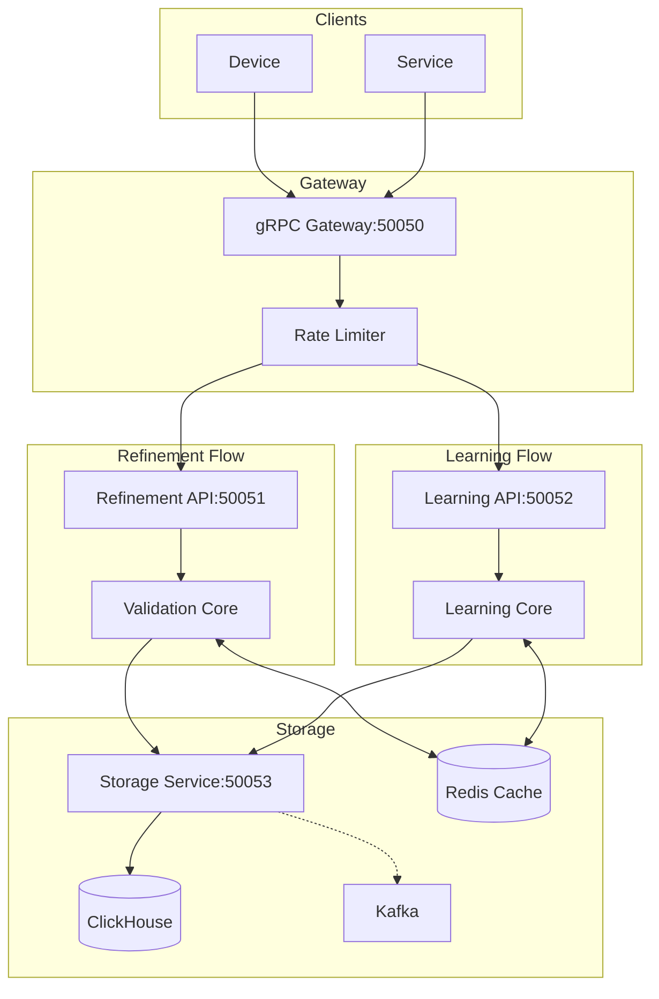

# Архитектура системы (v2.0)

> Гибридная микросервисная архитектура для валидации GPS координат

## Общая схема



## Микросервисы

### 1. API Gateway (порт 50050)
- **Назначение:** Входная точка, роутинг, rate limiting
- **Эндпоинты:**
  - `Validate` → Refinement API
  - `ValidateBatch` → Refinement API
  - `LearnFromCoordinates` → Learning API
  - `GetCompanionSources` → Learning API
- **Особенности:**
  - Балансировка нагрузки
  - Логирование запросов
  - Circuit breaker

### 2. Refinement API (порт 50051)
- **Назначение:** Валидация координат
- **Эндпоинты:** `Validate`, `ValidateBatch`
- **Особенность:** Только чтение, НЕ участвует в обучении
- **Результат:** VALID / INVALID / UNCERTAIN + confidence

### 3. Learning API (порт 50052)
- **Назначение:** Обучение модели
- **Эндпоинты:** `LearnFromCoordinates`, `GetCompanionSources`
- **Особенность:** Запись в кэш, обучение
- **Источники:** Только "companion" устройства

### 4. Storage Service (порт 50053)
- **Назначение:** Асинхронная запись
- **Функции:**
  - Batch запись в ClickHouse
  - Producer событий в Kafka
- **Особенность:** Не блокирует API

## Внутренние компоненты

### Validation Core
```
Layer 1: Rule-based (time/speed)     ← быстро, 90% cases
Layer 2: Triangulation (WiFi/Cell/BT) ← medium
```

- **Time Check:** `0 < (Now - timestamp) < 12h`
- **Speed Check:** `HaversineDistance / TimeDelta < 150 km/h`
- **Triangulation:** WiFi → Cell → BT (boost confidence)

### Learning Core
```
Online Learning  (real-time)  → Cache update, ~100ms
Offline Learning (batch)      → Model retrain, 1x/сутки
```

- **Companion Detection:** Co-occurrence анализ
- **Versioned Cache:** confidence на основе obs_count

## Потоки данных

### Refinement (валидация)

```
Client → Gateway → Refinement API → Validation Core → Redis (read)
                                                    ↓
                                              Storage Service
                                                    ↓
                                            ClickHouse + Kafka
```

### Learning (обучение)

```
Client → Gateway → Learning API → Learning Core → Redis (write)
                                                ↓
                                          Storage Service
                                                ↓
                                        ClickHouse + Kafka
```

## Структура Redis

| Key Pattern | Type | Description |
|-------------|------|-------------|
| `wifi:{bssid}` | Hash | lat, lon, version, obs_count, confidence |
| `cell:{cell_id}:{lac}` | Hash | lat, lon, version, obs_count |
| `bt:{mac}` | Hash | lat, lon, version, obs_count |
| `device:{device_id}` | Hash | last_lat, last_lon, last_time |
| `companions:{object_id}` | Set | point_type:point_id |

## Структура ClickHouse

**Таблица: `validation_requests`**

| Поле | Тип | Описание |
|------|-----|----------|
| device_id | String | ID устройства |
| latitude | Float64 | Широта |
| longitude | Float64 | Долгота |
| accuracy | Float32 | Точность |
| timestamp | Int64 | Время |
| has_wifi | Bool | Есть WiFi |
| has_bt | Bool | Есть Bluetooth |
| has_cell | Bool | Есть Cell towers |
| result | String | VALID/INVALID/UNCERTAIN |
| confidence | Float32 | Уверенность |
| flow_type | String | "refinement" или "learning" |
| insert_time | DateTime | Время вставки |

## Kafka Topics

| Topic | Описание | Потребители |
|-------|----------|-------------|
| `coord-validation` | События валидации | Analytics, ML |
| `coord-learning` | События обучения | Analytics |

## Deployment

### Docker Compose
```bash
docker-compose up -d
```

### Kubernetes
```yaml
# k8s/deployment.yaml
services:
  - gateway: 3 replicas
  - refinement-api: 5 replicas
  - learning-api: 2 replicas
  - storage-service: 2 replicas
```

## Конфигурация

### Environment Variables

| Переменная | Default | Описание |
|------------|---------|----------|
| SERVER_PORT | 50050 | Порт сервиса |
| REDIS_ADDR | localhost:6379 | Redis адрес |
| CLICKHOUSE_ADDR | localhost:9000 | ClickHouse адрес |
| KAFKA_BROKERS | localhost:9092 | Kafka брокеры |
| MAX_SPEED_KMH | 150 | Макс. скорость |
| MAX_TIME_DIFF | 12h | Макс. отклонение времени |

## Мониторинг

### Key Metrics
- Request rate (RPS)
- Latency (p50, p95, p99)
- Error rate
- Redis connections
- ClickHouse batch size
- Kafka lag

### Health Checks
- `/health` endpoint на каждом сервисе
- Liveness probe: процесс жив
- Readiness probe: зависимости доступны

## Преимущества архитектуры

1. **Изоляция потоков** — Refinement и Learning разделены
2. **Общий кэш** — быстрый доступ без синхронизации
3. **Асинхронный storage** — API не блокируется
4. **Масштабируемость** — можно реплицировать горячий путь
5. **Отказоустойчивость** — падение Learning не влияет на Refinement
