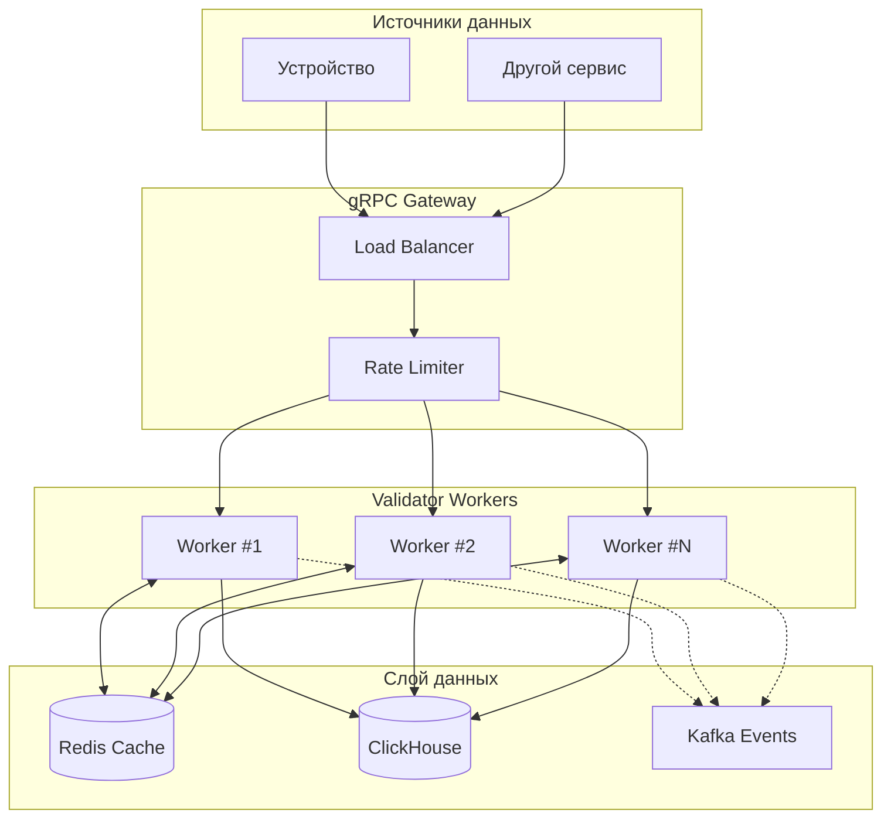
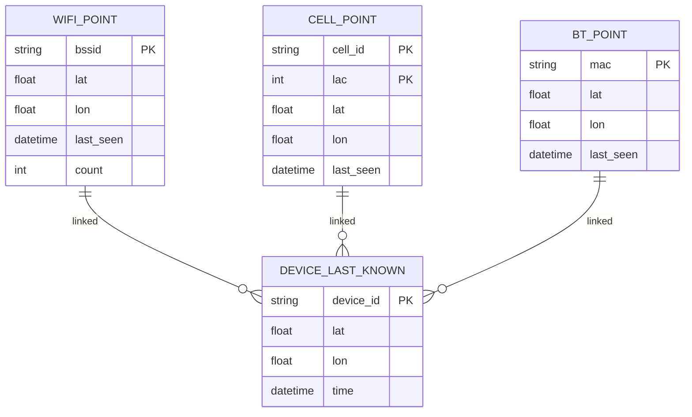
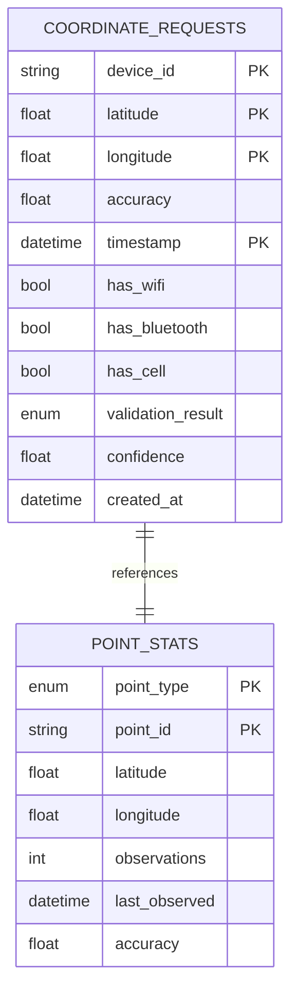
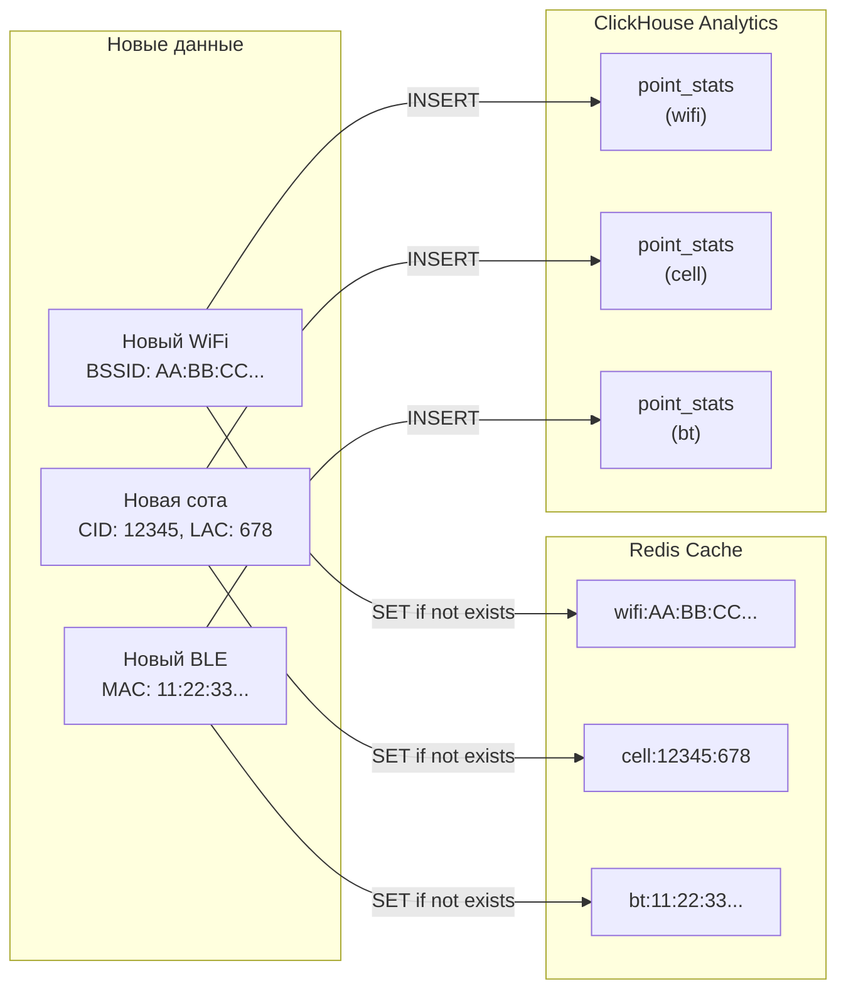
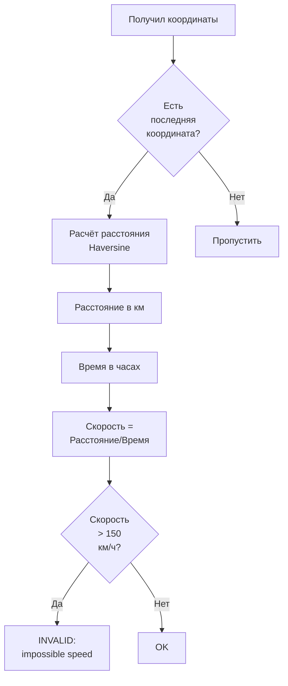
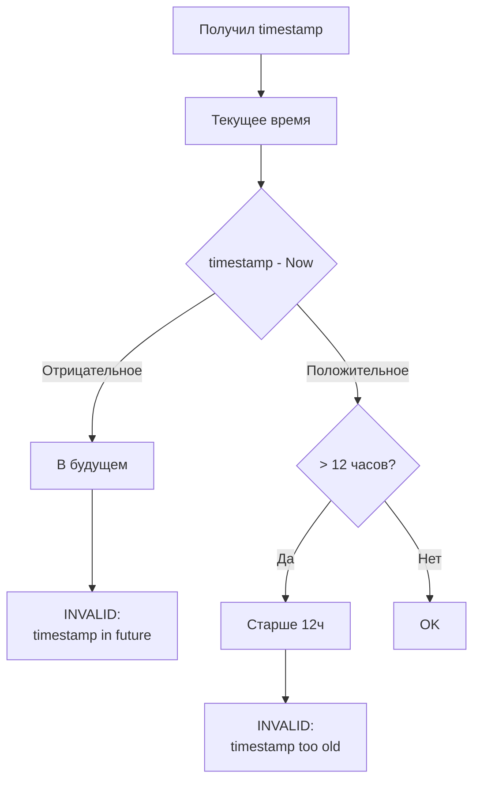
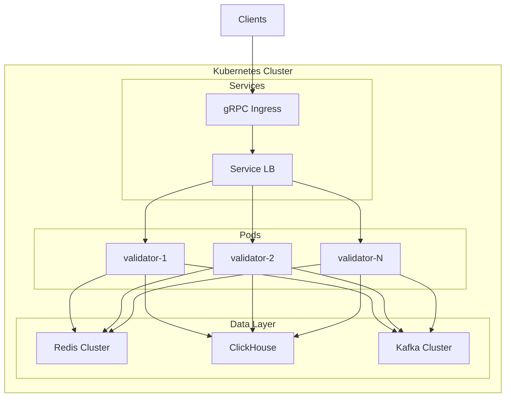

# Архитектура системы

## Общая схема



## Flow валидации


## Структура Redis



## Структура ClickHouse



## Алгоритм работы

### Flow валидации

```mermaid
flowchart TD
    subgraph Input["Входные данные (EGTS)"]
        Coord[Координаты: lat, lon, time]
        Wifi[WiFi: BSSID, RSSI]
        Cell[Cell: CID, LAC, MCC, MNC, RSSI]
        BT[BLE: MAC, RSSI]
    end

    subgraph Validation["Валидация"]
        TimeCheck{Время<br/>валидно?}
        TimeCheck -->|Нет| TimeFail[INVALID:<br/>будущее/старое]
        TimeCheck -->|Да| SpeedCheck
        
        SpeedCheck{Есть<br/>предыдущая<br/>координата?}
        SpeedCheck -->|Нет| WifiCheck
        SpeedCheck -->|Да| CalcSpeed[Расчёт<br/>скорости]
        
        CalcSpeed --> SpeedFail{>150<br/>км/ч?}
        SpeedFail -->|Да| SpeedFailRes[INVALID:<br/>невозможная<br/>скорость]
        SpeedFail -->|Нет| WifiCheck
        
        WifiCheck{WiFi<br/>данные<br/>есть?}
        WifiCheck -->|Да| WifiLookup[Поиск в Redis<br/>wifi:{BSSID}]
        WifiCheck -->|Нет| CellCheck
        
        WifiLookup --> WifiFound{Найден?}
        WifiFound -->|Да| WifiBoost[ confidence +0.3]
        WifiFound -->|Нет| WifiLearn[Записать на<br/>обучение]
        WifiBoost --> CellCheck
        WifiLearn --> CellCheck
        
        CellCheck{Cell towers<br/>есть?}
        CellCheck -->|Да| CellLookup[Поиск в Redis<br/>cell:{CID}:{LAC}]
        CellCheck -->|Нет| BTCheck
        
        CellLookup --> CellFound{Найден?}
        CellFound -->|Да| CellBoost[ confidence +0.2]
        CellFound -->|Нет| CellLearn[Записать на<br/>обучение]
        CellBoost --> BTCheck
        CellLearn --> BTCheck
        
        BTCheck{BLE<br/>данные<br/>есть?}
        BTCheck -->|Да| BTLookup[Поиск в Redis<br/>bt:{MAC}]
        BTCheck -->|Нет| FinalCheck
        
        BTLookup --> BTFound{Найден?}
        BTFound -->|Да| BTBoost[ confidence +0.1]
        BTFound -->|Нет| FinalCheck
        BTBoost --> FinalCheck
    end

    subgraph Decision["Итоговое решение"]
        FinalCheck{confidence<br/>> 0.5?}
        FinalCheck -->|Да| Valid[VALID]
        FinalCheck -->|Нет| Uncertain[UNCERTAIN]
        
        TimeFail --> Result[INVALID]
        SpeedFailRes --> Result
        Valid --> Result
        Uncertain --> Result
    end

    subgraph Output["Выход"]
        Result --> SaveHist[Сохранить в<br/>ClickHouse]
        Result --> UpdateCache[Обновить<br/>кеш]
        UpdateCache --> Response[Ответ:<br/>VALID/INVALID/UNCERTAIN]
    end
```

### Flow самообучения



### Детализация: Проверка по источникам

```mermaid
flowchart TB
    subgraph WiFiFlow["Проверка WiFi"]
        W1[Получил BSSID]
        W2[Запрос в Redis<br/>GET wifi:{BSSID}]
        W3{Ключ<br/>существует?}
        W3 -->|Да| W4[confidence += 0.3]
        W3 -->|Нет| W5[SET wifi:{BSSID}<br/>{lat, lon, time, count:1}]
        W5 --> W6[INSERT point_stats<br/>type: wifi]
        W4 --> W7[Результат]
    end

    subgraph CellFlow["Проверка Cell Tower"]
        C1[Получил CID, LAC]
        C2[Запрос в Redis<br/>GET cell:{CID}:{LAC}]
        C3{Ключ<br/>существует?}
        C3 -->|Да| C4[confidence += 0.2]
        C3 -->|Нет| C5[SET cell:{CID}:{LAC}<br/>{lat, lon, time, MCC, MNC}]
        C5 --> C6[INSERT point_stats<br/>type: cell]
        C4 --> C7[Результат]
    end

    subgraph BTFlow["Проверка Bluetooth"]
        B1[Получил MAC]
        B2[Запрос в Redis<br/>GET bt:{MAC}]
        B3{Ключ<br/>существует?}
        B3 -->|Да| B4[confidence += 0.1]
        B3 -->|Нет| B5[SET bt:{MAC}<br/>{lat, lon, time}]
        B5 --> B6[INSERT point_stats<br/>type: bt]
        B4 --> B7[Результат]
    end
```

### Проверка скорости



### Проверка времени



## Deployment


