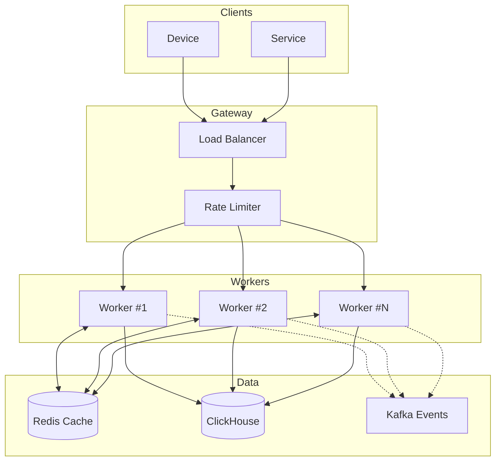
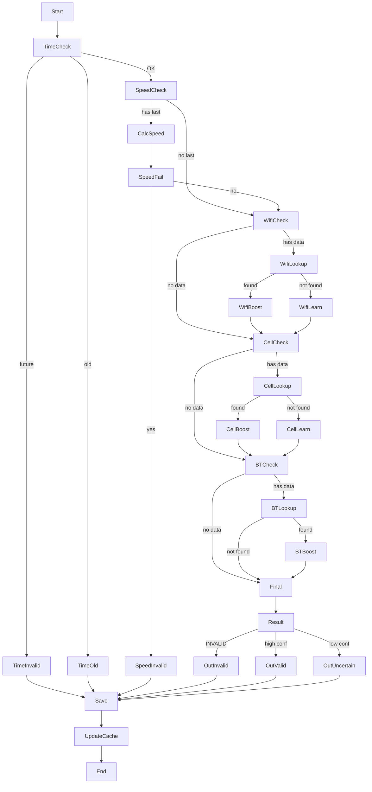
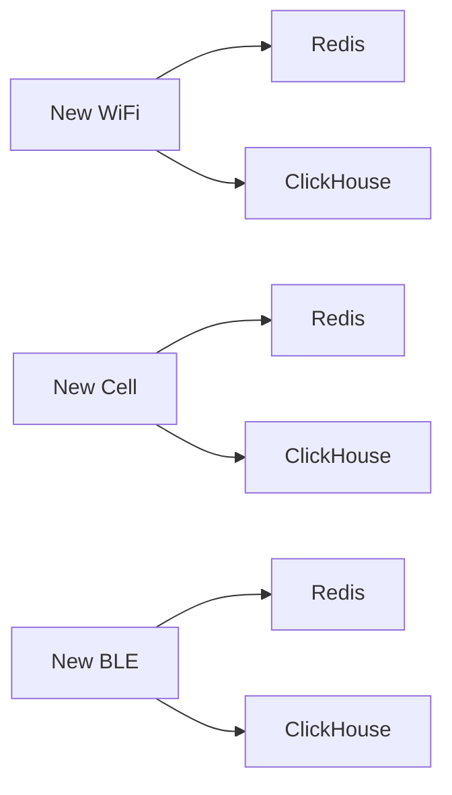
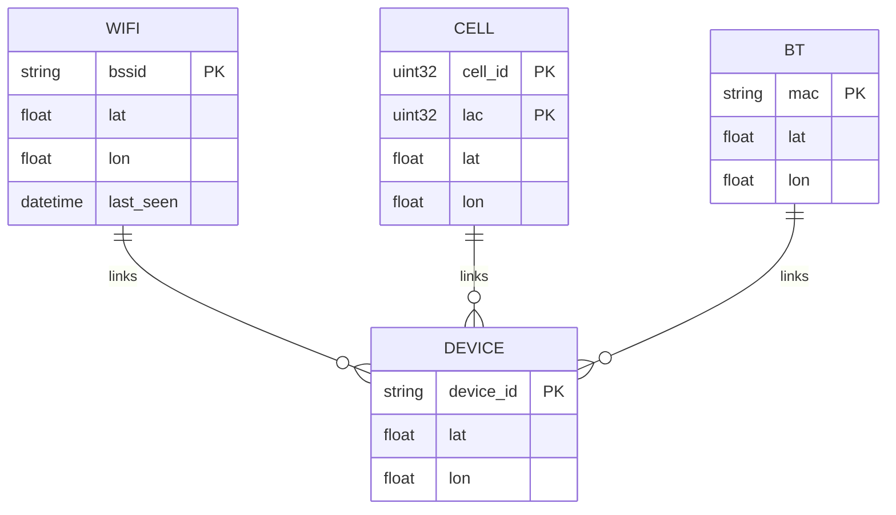
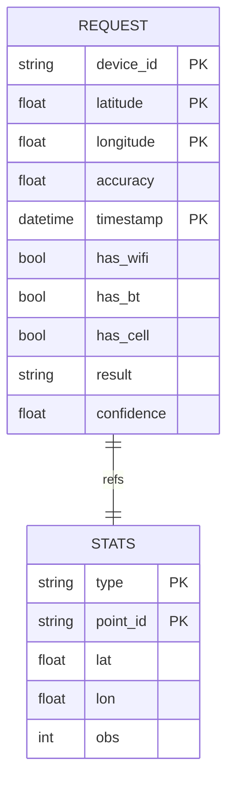
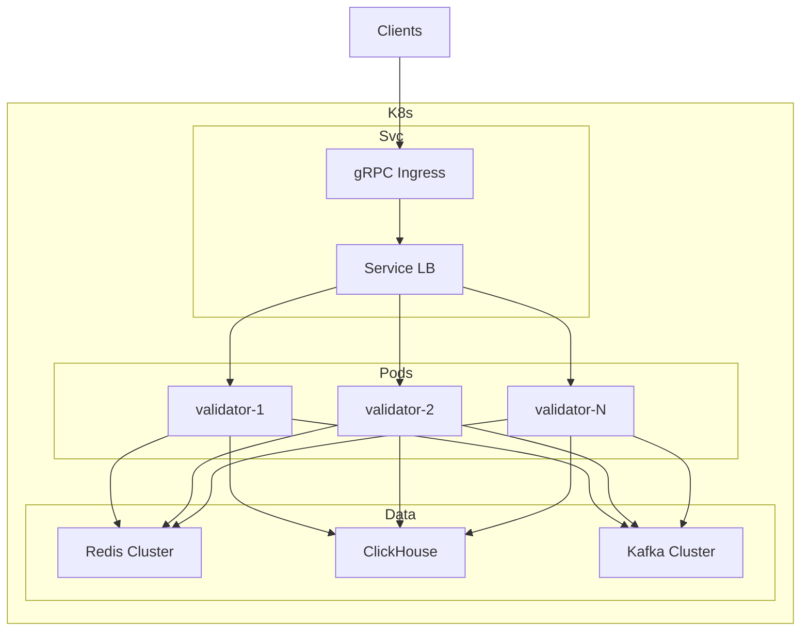

# Архитектура системы

## Общая схема



## Flow валидации



## Flow самообучения



## Структура Redis



## Структура ClickHouse



## Deployment



## Алгоритм работы

### Flow валидации

```
Input -> Time Check -> Speed Check -> Source Check -> Result
```

### Flow самообучения

```
New Data -> Redis Cache -> ClickHouse Analytics
```

### Проверка скорости

```
Calculate Haversine -> Distance / Time -> Compare to 150 km/h
```

### Проверка времени

```
Timestamp - Now -> Check bounds (0 to 12 hours)
```
