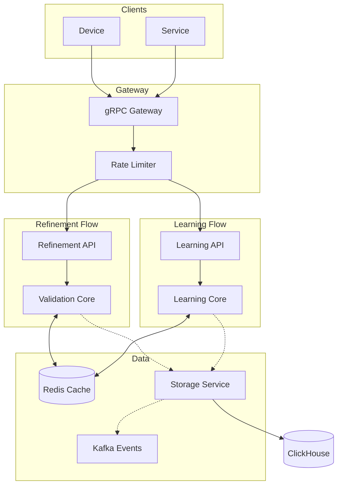
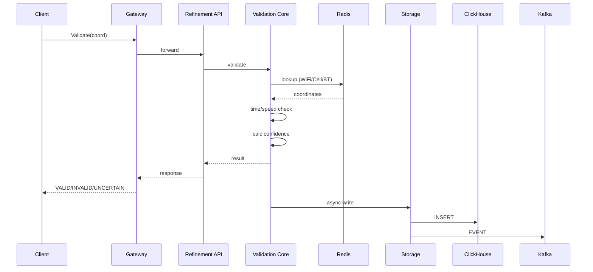
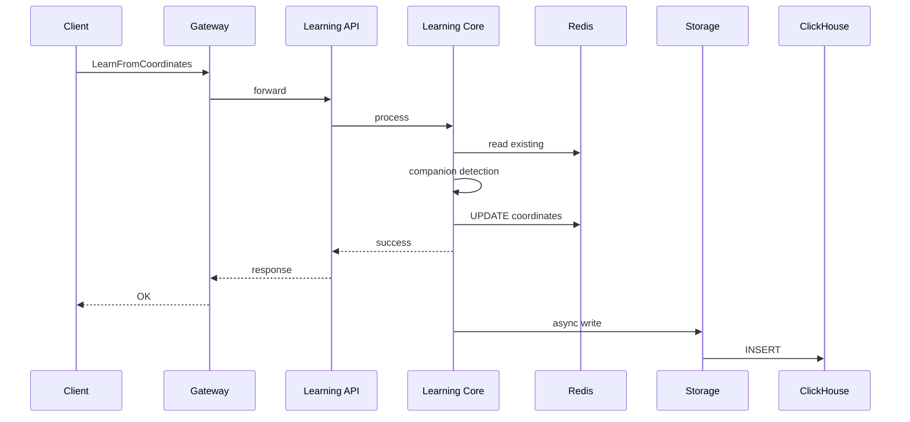
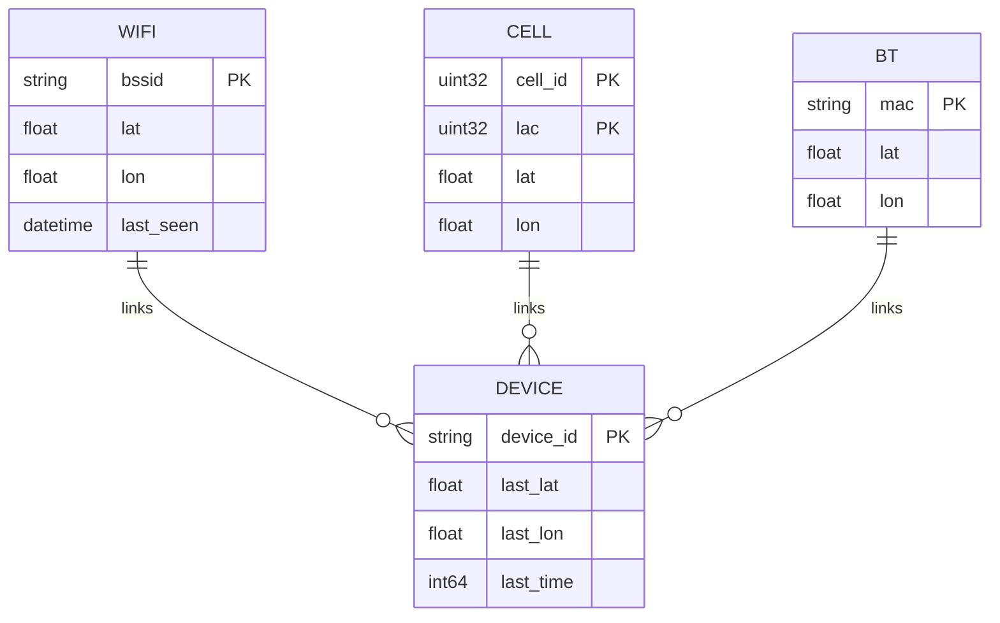
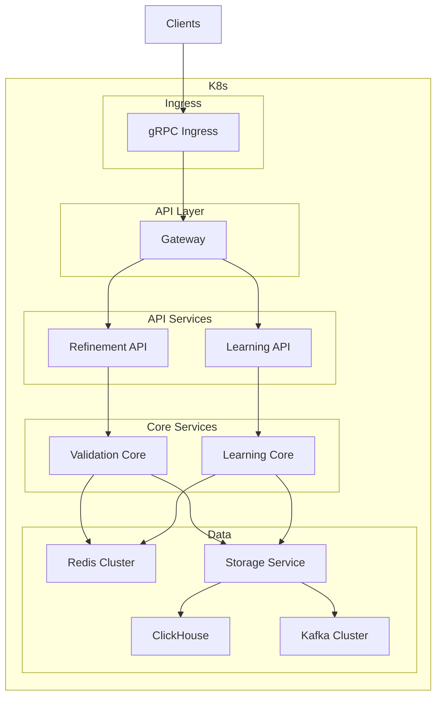

# Архитектура системы

> **Версия 2.0 — Гибридная микросервисная архитектура**

## Общая схема



## Микросервисы

### 1. API Gateway
- **Порт:** 50051
- **Функции:**
  - gRPC входная точка
  - Rate limiting
  - Роутинг: Refinement API vs Learning API
  - Логирование запросов

### 2. Refinement API
- **Эндпоинты:** `Validate`, `ValidateBatch`
- **Особенность:** Только чтение, НЕ участвует в обучении
- **Результат:** VALID / INVALID / UNCERTAIN + confidence

### 3. Learning API
- **Эндпоинты:** `LearnFromCoordinates`, `GetCompanionSources`
- **Особенность:** Запись в кэш, обучение модели
- **Источники:** Только "companion" устройства

### 4. Validation Core
- **Логика:**
  - Time Check: timestamp в пределах 0-12 часов
  - Speed Check: max 150 км/ч (Haversine distance / time)
  - Triangulation: WiFi → Cell → Bluetooth
- **Кэш:** Read-only доступ к Redis

### 5. Learning Core
- **Логика:**
  - Companion detection (co-occurrence анализ)
  - Обновление CALCULATED координат
  - Агрегация данных для аналитики

### 6. Storage Service
- **Функции:**
  - Асинхронная запись в ClickHouse
  - Producer событий в Kafka
- **Особенность:** Не блокирует API

## Потоки данных

### Refinement (валидация)



### Learning (обучение)



## Структура Redis



### Key Schema

| Key Pattern | Type | Description |
|-------------|------|-------------|
| `wifi:{bssid}` | Hash | lat, lon, last_seen |
| `cell:{cell_id}:{lac}` | Hash | lat, lon |
| `bt:{mac}` | Hash | lat, lon |
| `device:{device_id}` | Hash | last_lat, last_lon, last_time |

## Структура ClickHouse

```mermaid
erDiagram
    REQUEST ||--|| STATS : "refs"
    
    REQUEST {
        string device_id PK
        float latitude PK
        float longitude PK
        float accuracy
        datetime timestamp PK
        bool has_wifi
        bool has_bt
        bool has_cell
        string result
        float confidence
        string flow_type  # "refinement" or "learning"
    }
    
    STATS {
        string type PK        # "wifi", "cell", "bt"
        string point_id PK    # bssid / cell_id / mac
        float lat
        float lon
        int obs
        datetime last_updated
    }
```

## Deployment



## Алгоритм работы

### Flow валидации (Refinement)

```
Input → Time Check → Speed Check → Source Lookup → Confidence → Result
```

1. **Time Check:** `0 < (Now - timestamp) < 12h`
2. **Speed Check:** `HaversineDistance(lat1,lon1, lat2,lon2) / TimeDelta < 150 km/h`
3. **Source Lookup:** WiFi → Cell → BT (boost confidence если найдено)
4. **Result:** VALID / INVALID / UNCERTAIN

### Flow самообучения (Learning)

```
New Data → Companion Filter → Cache Update → Analytics
```

1. **Companion Filter:** Только co-occurrence источники
2. **Cache Update:** Запись в Redis
3. **Analytics:** ClickHouse для долгосрочного анализа

## Разделение потоков

| Поток | API | Операции с кэшем | Обучение |
|-------|-----|------------------|----------|
| Refinement | Validate, ValidateBatch | Read only | Нет |
| Learning | LearnFromCoordinates | Read + Write | Да |

## Преимущества архитектуры

1. **Изоляция потоков** — Refinement и Learning не влияют друг на друга
2. **Общий кэш** — быстрый доступ к координатам без синхронизации
3. **Асинхронный storage** — API не блокируется на записи
4. **Масштабируемость** — можно реплицировать только горячий путь (валидация)
5. **Гибкость** — каждый сервис развивается отдельно
6. **Отказоустойчивость** — падение Learning не влияет на Refinement
