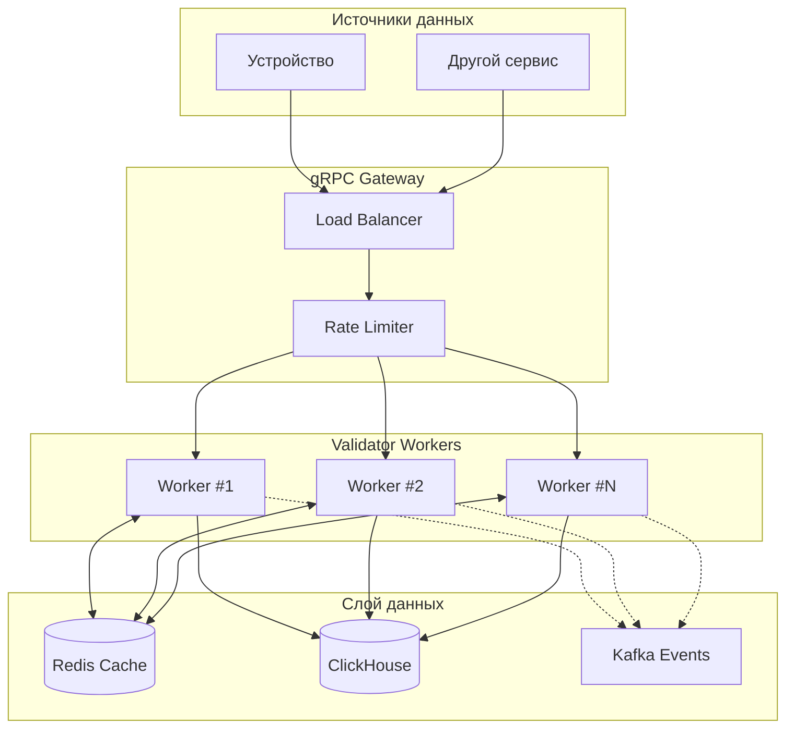
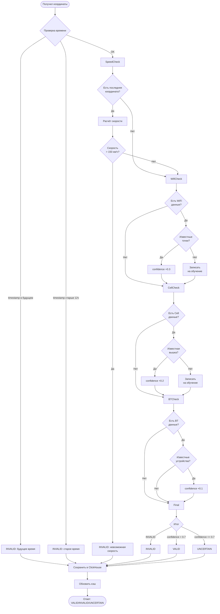
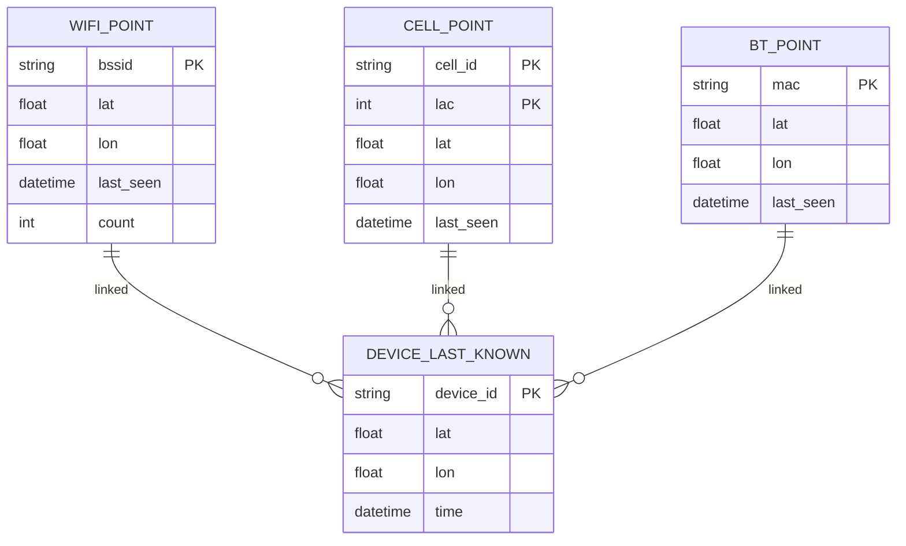
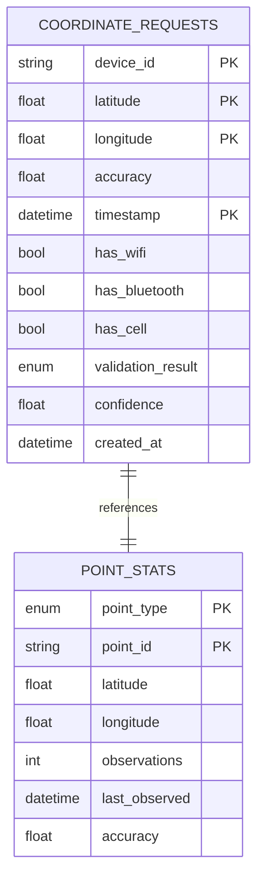
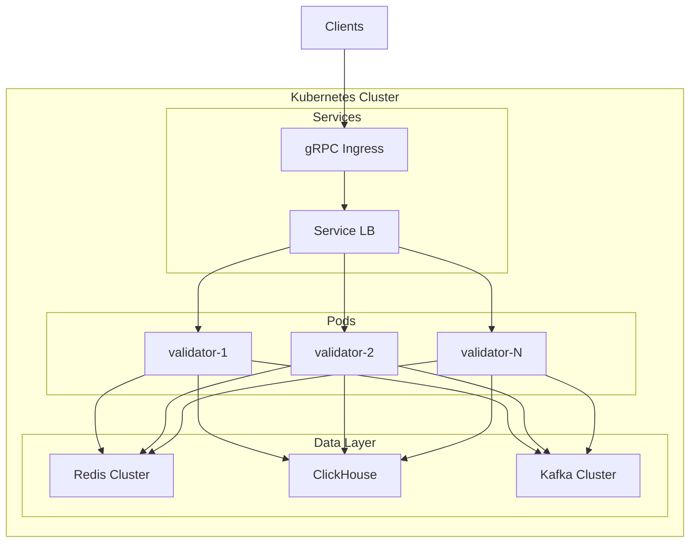

# Архитектура системы

## Общая схема

```mermaid
flowchart TB
    subgraph Clients["Источники данных"]
        Device[Устройство]
        Service[Другой сервис]
    end

    subgraph Gateway["gRPC Gateway"]
        LB[Load Balancer]
        RateLimit[Rate Limiter]
    end

    subgraph Workers["Validator Workers"]
        W1[Worker #1]
        W2[Worker #2]
        W3[Worker #N]
    end

    subgraph Data["Слой данных"]
        Redis[(Redis Cache)]
        ClickHouse[(ClickHouse)]
        Kafka[Kafka Events]
    end

    Device --> LB
    Service --> LB
    LB --> RateLimit
    RateLimit --> W1
    RateLimit --> W2
    RateLimit --> W3

    W1 <--> Redis
    W2 <--> Redis
    W3 <--> Redis

    W1 --> ClickHouse
    W2 --> ClickHouse
    W3 --> ClickHouse

    W1 -.-> Kafka
    W2 -.-> Kafka
    W3 -.-> Kafka
```

## Flow валидации

```mermaid
flowchart TD
    Start([Получил координаты]) --> TimeCheck{Проверка времени}
    
    TimeCheck -->|timestamp в будущем| TimeInvalid[INVALID: будущее время]
    TimeCheck -->|timestamp старше 12ч| TimeOld[INVALID: старое время]
    TimeCheck -->|OK| SpeedCheck
    
    SpeedCheck --> LastLoc{Есть последняя<br/>координата?}
    
    LastLoc -->|Нет| WifiCheck
    LastLoc -->|Да| CalcSpeed[Расчёт скорости]
    
    CalcSpeed --> SpeedValid{Скорость<br/>> 150 км/ч?}
    
    SpeedValid -->|Да| SpeedInvalid[INVALID: невозможная скорость]
    SpeedValid -->|Нет| WifiCheck
    
    WifiCheck --> WifiData{Есть WiFi<br/>данные?}
    
    WifiData -->|Да| WifiKnown{Известные<br/>точки?}
    WifiData -->|Нет| CellCheck
    
    WifiKnown -->|Да| WifiBoost[ confidence +0.3]
    WifiKnown -->|Нет| WifiRecord[Записать<br/>на обучение]
    
    WifiBoost --> CellCheck
    WifiRecord --> CellCheck
    
    CellCheck --> CellData{Есть Cell<br/>данные?}
    
    CellData -->|Да| CellKnown{Известная<br/>вышка?}
    CellData -->|Нет| BTCheck
    
    CellKnown -->|Да| CellBoost[ confidence +0.2]
    CellKnown -->|Нет| CellRecord[Записать<br/>на обучение]
    
    CellBoost --> BTCheck
    CellRecord --> BTCheck
    
    BTCheck --> BTData{Есть BT<br/>данные?}
    
    BTData -->|Да| BTKnown{Известные<br/>устройства?}
    BTData -->|Нет| Final
    
    BTKnown -->|Да| BTBoost[ confidence +0.1]
    BTKnown -->|Нет| Final
    
    BTBoost --> Final
    
    Final --> Result{Итог}
    
    Result -->|INVALID| OutInvalid[INVALID]
    Result -->|confidence > 0.7| OutValid[VALID]
    Result -->|confidence <= 0.7| OutUncertain[UNCERTAIN]
    
    TimeInvalid --> Save[Сохранить в ClickHouse]
    TimeOld --> Save
    SpeedInvalid --> Save
    OutInvalid --> Save
    OutValid --> Save
    OutUncertain --> Save
    
    Save --> UpdateCache[Обновить кэш]
    UpdateCache --> End([Ответ: VALID/INVALID/UNCERTAIN])
```

## Структура Redis

```mermaid
erDiagram
    WIFI_POINT ||--o{ DEVICE_LAST_KNOWN : "linked"
    CELL_POINT ||--o{ DEVICE_LAST_KNOWN : "linked"
    BT_POINT ||--o{ DEVICE_LAST_KNOWN : "linked"
    
    WIFI_POINT {
        string bssid PK
        float lat
        float lon
        datetime last_seen
        int count
    }
    
    CELL_POINT {
        string cell_id PK
        int lac PK
        float lat
        float lon
        datetime last_seen
    }
    
    BT_POINT {
        string mac PK
        float lat
        float lon
        datetime last_seen
    }
    
    DEVICE_LAST_KNOWN {
        string device_id PK
        float lat
        float lon
        datetime time
    }
```

## Структура ClickHouse

```mermaid
erDiagram
    COORDINATE_REQUESTS ||--|| POINT_STATS : "references"
    
    COORDINATE_REQUESTS {
        string device_id PK
        float latitude PK
        float longitude PK
        float accuracy
        datetime timestamp PK
        bool has_wifi
        bool has_bluetooth
        bool has_cell
        enum validation_result
        float confidence
        datetime created_at
    }
    
    POINT_STATS {
        enum point_type PK
        string point_id PK
        float latitude
        float longitude
        int observations
        datetime last_observed
        float accuracy
    }
```

## Deployment

```mermaid
flowchart TB
    subgraph Kubernetes["Kubernetes Cluster"]
        subgraph Services["Services"]
            Ingress[gRPC Ingress]
            SVC[Service LB]
        end
        
        subgraph Pods["Pods"]
            Pod1[validator-1]
            Pod2[validator-2]
            Pod3[validator-N]
        end
        
        subgraph Data["Data Layer"]
            RedisCl[Redis Cluster]
            CH[ClickHouse]
            KafkaCl[Kafka Cluster]
        end
    end
    
    Clients --> Ingress
    Ingress --> SVC
    SVC --> Pod1
    SVC --> Pod2
    SVC --> Pod3
    
    Pod1 --> RedisCl
    Pod2 --> RedisCl
    Pod3 --> RedisCl
    
    Pod1 --> CH
    Pod2 --> CH
    Pod3 --> CH
    
    Pod1 --> KafkaCl
    Pod2 --> KafkaCl
    Pod3 --> KafkaCl
```
