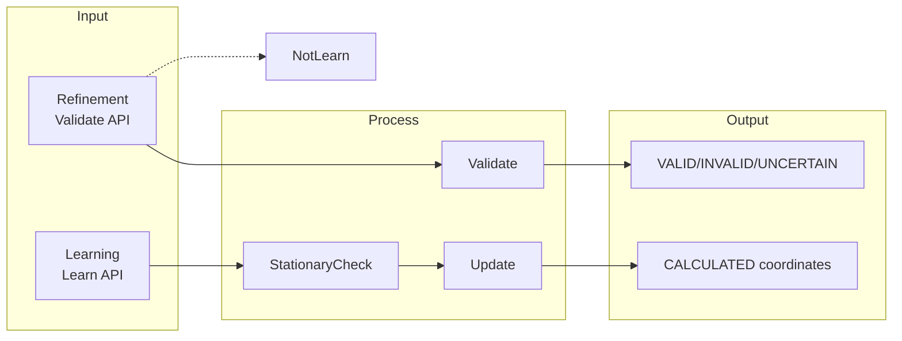
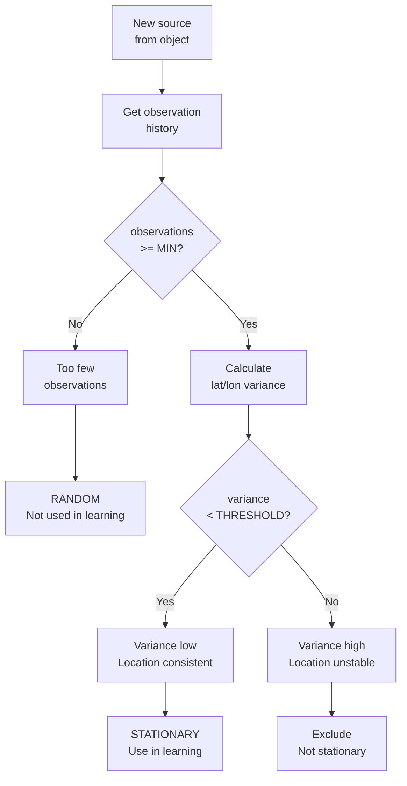

# Coordinate Validator - Learning Model

## Two Data Streams

### 1. Refinement (Validation)
- Incoming data for **validation**
- Used ONLY for checking coordinates
- Does NOT participate in learning

### 2. Learning
- Separate data stream
- Only "stationary" sources
- Updates CALCULATED coordinates

---

## Filter: Stationary Detection

### Problem
WiFi/BLE sources can be:
- **Stationary** - permanently at fixed location (home WiFi, office AP)
- **Random** - appearing only once or rarely (passing by)

### Solution: Stationarity Check

```
Source is STATIONARY if:
- Appears at least MIN times
- Location is consistent (low variance)
```

### Parameters

| Parameter | Value | Description |
|-----------|-------|-------------|
| MIN_OBSERVATIONS | 3 | Min appearances for stationary |
| VARIANCE_THRESHOLD | 0.0001 | Max lat/lon variance (roughly 10m) |
| TIME_WINDOW | 24 hours | Analysis window |

---

## Architecture



---

## API

### Refinement (NO learning)

```protobuf
service CoordinateValidator {
    rpc Validate(CoordinateRequest) returns (CoordinateResponse);
    rpc ValidateBatch(stream CoordinateRequest) returns (stream CoordinateResponse);
}
```

### Learning (separate stream)

```protobuf
service LearningService {
    rpc LearnFromCoordinates(LearnRequest) returns (LearnResponse);
    rpc GetStationarySources(GetStationaryRequest) returns (GetStationaryResponse);
}

message LearnRequest {
    string object_id = 1;
    double latitude = 2;
    double longitude = 3;
    float accuracy = 4;
    int64 timestamp = 5;
    
    repeated WifiAccessPoint wifi = 6;
    repeated BluetoothDevice bluetooth = 7;
    repeated CellTower cell_towers = 8;
}

message LearnResponse {
    LearningResult result = 1;
    repeated string stationary_sources = 2;  // Added to learning
    repeated string random_sources = 3;       // Excluded - too few observations
}

enum LearningResult {
    LEARNED = 0;
    NEED_MORE_DATA = 1;
    STATIONARY_DETECTED = 2;
    RANDOM_EXCLUDED = 3;
}

message GetStationaryRequest {
    string object_id = 1;
    PointType point_type = 2;
}

message GetStationaryResponse {
    repeated StationarySource sources = 1;
}

message StationarySource {
    string point_id = 1;
    PointType point_type = 2;
    int32 observations = 3;
    float variance = 4;
    bool is_stationary = 5;
    int64 first_seen = 6;
    int64 last_seen = 7;
}
```

---

## Algorithm: Stationary Detection



### Status Values

| Status | Condition | Learning |
|--------|-----------|----------|
| **NEW** | First appearance | ❌ No |
| **STATIONARY** | Observations >= MIN AND variance < threshold | ✅ Yes |
| **RANDOM** | Observations < MIN OR variance > threshold | ❌ No |

---

## Redis Structure

```
# Source observations (for stationary detection)
observation:{object_id}:{source_type}:{source_id} → {
    object_id,
    source_type,    // wifi, ble, cell
    source_id,      // BSSID, MAC, CellID
    observations: [
        {lat, lon, timestamp},
        {lat, lon, timestamp},
        ...
    ],
    observations_count,
    variance_lat,
    variance_lon,
    status: NEW | STATIONARY | RANDOM,
    first_seen,
    last_seen
}

# CALCULATED coordinates
calculated:{type}:{id} → {
    lat, lon, confidence, observations
}

# ABSOLUTE coordinates
absolute:{type}:{id} → {
    lat, lon, accuracy, source, expires_at
}
```

---

## Examples

### Example 1: New source

```
Request LearnFromCoordinates:
  object_id: "vehicle_123"
  WiFi: ["AA:BB:CC:DD:EE:FF"]

Redis:
  observation:vehicle_123:wifi:AA:BB:CC:DD:EE:FF
    observations: [{lat: 55.75, lon: 37.61, ts: ...}]
    observations_count: 1
    status: NEW

Response:
  result: NEED_MORE_DATA
  stationary_sources: []
  random_sources: []
```

### Example 2: Random (too few observations)

```
After 2 observations:
  observations_count: 2
  MIN_OBSERVATIONS: 3
  status: RANDOM (not enough data)

Response:
  result: RANDOM_EXCLUDED
  random_sources: ["wifi:AA:BB:CC:DD:EE:FF"]
```

### Example 3: Stationary detected

```
After 5 observations:
  observations: [
    {lat: 55.7558, lon: 37.6173},
    {lat: 55.7559, lon: 37.6174},
    {lat: 55.7557, lon: 37.6172},
    {lat: 55.7558, lon: 37.6173},
    {lat: 55.7559, lon: 37.6174}
  ]
  observations_count: 5
  variance_lat: 0.00001
  variance_lon: 0.00001
  VARIANCE_THRESHOLD: 0.0001
  status: STATIONARY

Response:
  result: STATIONARY_DETECTED
  stationary_sources: ["wifi:AA:BB:CC:DD:EE:FF"]

CALCULATED updated
```

### Example 4: Random (high variance)

```
After 5 observations:
  observations: [
    {lat: 55.75, lon: 37.61},
    {lat: 55.80, lon: 37.70},
    {lat: 55.60, lon: 37.50},
    {lat: 55.90, lon: 37.80},
    {lat: 55.70, lon: 37.55}
  ]
  observations_count: 5
  variance_lat: 0.015
  variance_lon: 0.020
  VARIANCE_THRESHOLD: 0.0001
  status: RANDOM (high variance)

Response:
  result: RANDOM_EXCLUDED
  random_sources: ["wifi:AA:BB:CC:DD:EE:FF"]
```

---

## Three Coordinate Types

| Type | Purpose | Source |
|------|---------|--------|
| **ABSOLUTE** | Reference | Reliable API |
| **CALCULATED** | Computed | Learning |
| **DEVIATION** | Deviations | Current measurements |

### Rules

1. **Refinement (Validate)** - uses ABSOLUTE/CALCULATED, does NOT learn
2. **Learning (Learn)** - only STATIONARY sources update CALCULATED
3. **ABSOLUTE** - reference only, not learned

---

## Triangulation

### Uncertainty Radii

| Source | Radius |
|--------|--------|
| WiFi | 50m |
| BLE | 15m |
| Cell (LAC) | 3000m |
| Cell (ATC) | 300m |

### Intersection

```
WiFi (BSSID) ──┐
                 │  → Intersection center → Position
Cell Tower ─────┤
                 │
BLE Device ─────┘
```

---

## Configuration

```yaml
learning:
  # Minimum observations for stationary status
  min_observations: 3
  
  # Maximum variance for stationary (degrees^2)
  # 0.0001 ≈ 10 meters
  variance_threshold: 0.0001
  
  # Analysis time window (hours)
  time_window_hours: 24

positioning:
  radius:
    wifi: 50
    ble: 15
    cell_lac: 3000
    cell_atc: 300
  
  min_sources: 2
  
  deviation_threshold: 50
```

---

## Summary

| Stream | Method | Learning |
|--------|--------|----------|
| Refinement | Validate() | ❌ NO |
| Learning | LearnFromCoordinates() | ✅ YES |

| Source Status | Condition | Learning |
|---------------|-----------|----------|
| **NEW** | First appearance | ❌ No |
| **STATIONARY** | >= MIN observations AND variance < threshold | ✅ Yes |
| **RANDOM** | < MIN observations OR variance > threshold | ❌ No |
