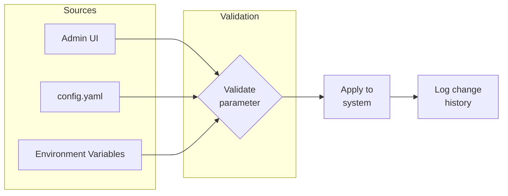
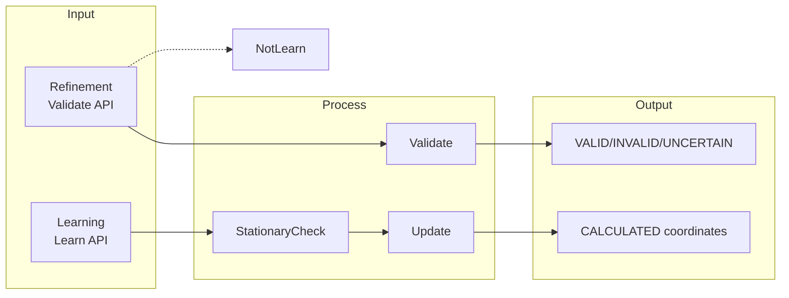
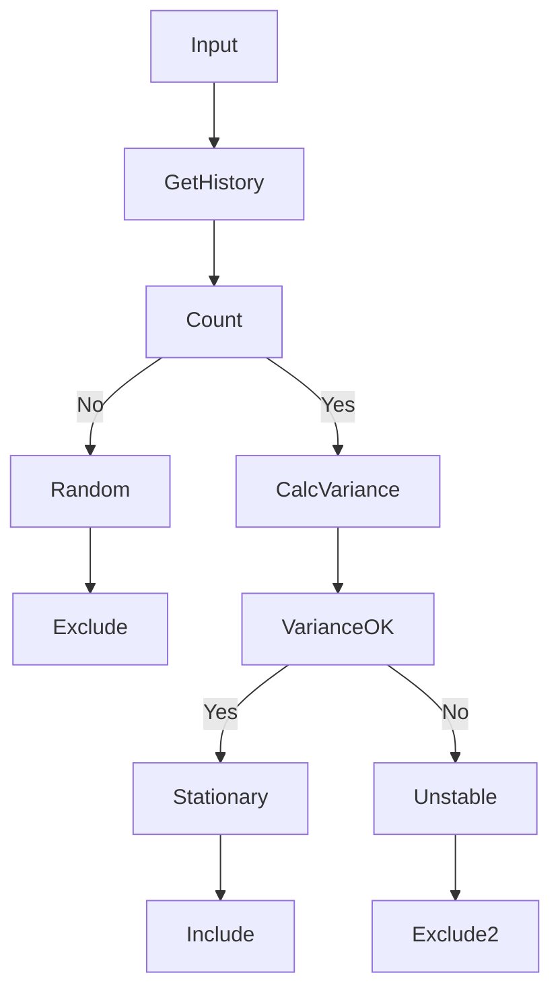

# Coordinate Validator - Learning Model

## Two Data Streams

### 1. Refinement (Validation)
- Incoming data for **validation**
- Used ONLY for checking coordinates
- Does NOT participate in learning

### 2. Learning
- Separate data stream
- Only "stationary" sources
- Updates CALCULATED coordinates

---

## Configuration Parameters

All thresholds are configurable via Admin API or configuration file.

### Validation Parameters

| Parameter | Default | Range | Description |
|-----------|---------|-------|-------------|
| `validation.max_speed_kmh` | 150 | 50-500 | Max allowed speed (km/h) |
| `validation.max_time_diff_hours` | 12 | 1-72 | Max timestamp deviation (hours) |
| `validation.min_accuracy_meters` | 100 | 10-500 | Min GPS accuracy to accept |

### Stationary Detection Parameters

| Parameter | Default | Range | Description |
|-----------|---------|-------|-------------|
| `learning.min_observations` | 3 | 1-10 | Min appearances for stationary |
| `learning.variance_threshold` | 0.0001 | 0.00001-0.001 | Max lat/lon variance (degrees² ≈ meters) |
| `learning.time_window_hours` | 24 | 1-168 | Analysis time window |

### Positioning Parameters

| Parameter | Default | Range | Description |
|-----------|---------|-------|-------------|
| `positioning.radius_wifi_meters` | 50 | 10-100 | WiFi uncertainty radius |
| `positioning.radius_ble_meters` | 5 | 1-30 | BLE uncertainty radius |
| `positioning.radius_cell_lac_meters` | 3000 | 500-10000 | Cell LAC uncertainty radius |
| `positioning.radius_cell_atc_meters` | 300 | 50-1000 | Cell ATC uncertainty radius |
| `positioning.min_sources` | 2 | 1-5 | Min sources for triangulation |
| `positioning.deviation_threshold_meters` | 50 | 10-200 | Max deviation for validation |

### Adaptive Thresholds

Thresholds scale based on number of sources:

```yaml
# Formula: BASE + (sources - 1) * STEP
adaptive:
  absolute_threshold_base: 50      # meters
  absolute_threshold_step: 10      # per source
  deviation_threshold_base: 100    # meters
  deviation_threshold_step: 20     # per source
```

### Mobile Filter Parameters

| Parameter | Default | Description |
|-----------|---------|-------------|
| `filter.rssi_change_threshold` | 10 | Max RSSI change (dBm) per window |
| `filter.rssi_change_window_seconds` | 60 | RSSI analysis window |

---

## Admin API

All parameters can be managed via Admin API:

```protobuf
service AdminService {
    // Get all parameters
    rpc GetConfig(GetConfigRequest) returns (GetConfigResponse);
    
    // Update parameter
    rpc UpdateConfig(UpdateConfigRequest) returns (UpdateConfigResponse);
    
    // Reset to defaults
    rpc ResetConfig(ResetConfigRequest) returns (ResetConfigResponse);
    
    // Get config history
    rpc GetConfigHistory(HistoryRequest) returns (HistoryResponse);
}

message GetConfigRequest {
    string category = 1;  // "validation", "learning", "positioning", "filter"
}

message UpdateConfigRequest {
    string key = 1;
    string value = 2;
    string reason = 3;  // Reason for change
}

message UpdateConfigResponse {
    bool success = 1;
    string old_value = 2;
    string new_value = 3;
    int64 changed_at = 4;
}
```

### Example: Update threshold

```bash
# Update max speed
grpcurl -plaintext -d '{
  "key": "validation.max_speed_kmh",
  "value": "200",
  "reason": "High-speed vehicle tracking"
}' localhost:50051 coordinate.Admin/UpdateConfig

# Get all learning params
grpcurl -plaintext -d '{
  "category": "learning"
}' localhost:50051 coordinate.Admin/GetConfig
```

---

## Configuration File

```yaml
validation:
  max_speed_kmh: 150
  max_time_diff_hours: 12
  min_accuracy_meters: 100

learning:
  min_observations: 3
  variance_threshold: 0.0001
  time_window_hours: 24

positioning:
  radius_wifi_meters: 50
  radius_ble_meters: 15
  radius_cell_lac_meters: 3000
  radius_cell_atc_meters: 300
  min_sources: 2
  deviation_threshold_meters: 50

adaptive:
  absolute_threshold_base: 50
  absolute_threshold_step: 10
  deviation_threshold_base: 100
  deviation_threshold_step: 20

filter:
  rssi_change_threshold: 10
  rssi_change_window_seconds: 60
```

---

## Configuration Flow



---

## Architecture



---

## Algorithm: Stationary Detection



---

## Redis Structure

```
# Configuration (cached)
config:{category}:{key} → value

# Configuration history
config_history:{key} → [
    {value, changed_at, changed_by, reason},
    ...
]

# Source observations
observation:{object_id}:{source_type}:{source_id} → {
    observations: [{lat, lon, timestamp}],
    observations_count,
    variance_lat, variance_lon,
    status: NEW | STATIONARY | RANDOM,
    first_seen, last_seen
}

# CALCULATED coordinates
calculated:{type}:{id} → {lat, lon, confidence, observations}

# ABSOLUTE coordinates
absolute:{type}:{id} → {lat, lon, accuracy, source, expires_at}
```

---

## Summary

| Category | Parameters | Admin API |
|----------|------------|-----------|
| Validation | max_speed, max_time, min_accuracy | ✅ |
| Learning | min_observations, variance, time_window | ✅ |
| Positioning | radii, min_sources, deviation | ✅ |
| Adaptive | threshold_base, threshold_step | ✅ |
| Filter | rssi_change_threshold | ✅ |

All parameters are runtime-configurable with history tracking.
