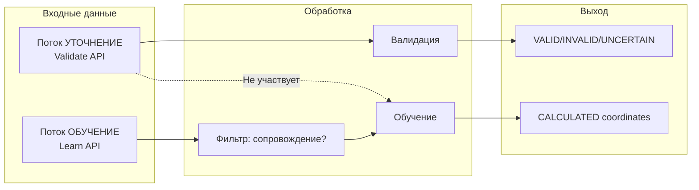
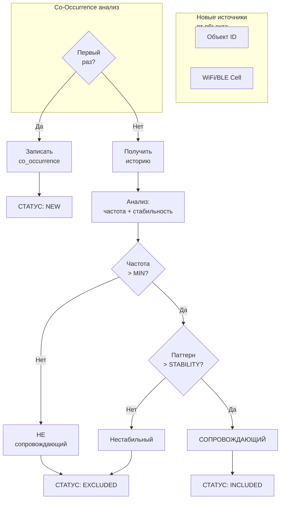

# Coordinate Validator - Модель данных

## Два потока данных

### 1. Уточнение (Refinement)
- Входящие данные для **валидации**
- Используются ТОЛЬКО для проверки координат
- **НЕ участвуют в обучении**

### 2. Обучение (Learning)
- Отдельный поток данных
- Только "сопровождающие" источники
- Обновляет CALCULATED координаты

---

## Фильтр: определение "сопровождающих"

### Проблема
WiFi/BLE источники могут быть:
- **Сопровождающие** — постоянно рядом с объектом
- **Проходящие мимо** — появились 1 раз

### Решение: Анализ co-occurrence

```
Источник X сопровождает объект Y если:
- Появляется вместе > N раз
- Паттерн появления стабилен
```

### Параметры

| Параметр | Значение | Описание |
|-----------|----------|----------|
| MIN_CO_OCCURRENCES | 3 | Мин. совместных появлений |
| CO_OCCURRENCE_WINDOW | 1 час | Окно анализа |
| STABILITY_THRESHOLD | 0.7 | Стабильность паттерна |

---

## Архитектура потоков



---

## API

### Уточнение (Refinement)

```protobuf
service CoordinateValidator {
    // Только валидация, НЕ обучение
    rpc Validate(CoordinateRequest) returns (CoordinateResponse);
    rpc ValidateBatch(stream CoordinateRequest) returns (stream CoordinateResponse);
}
```

### Обучение (Learning)

```protobuf
service LearningService {
    // Обучение - отдельный поток
    rpc LearnFromCoordinates(LearnRequest) returns (LearnResponse);
    
    // Получить список сопровождающих источников
    rpc GetCompanionSources(GetCompanionsRequest) returns (GetCompanionsResponse);
}

message LearnRequest {
    string object_id = 1;       // ID объекта
    double latitude = 2;
    double longitude = 3;
    float accuracy = 4;
    int64 timestamp = 5;
    
    // Источники для анализа
    repeated WifiAccessPoint wifi = 6;
    repeated BluetoothDevice bluetooth = 7;
    repeated CellTower cell_towers = 8;
}

message LearnResponse {
    LearningResult result = 1;
    repeated string included_sources = 2;   // Сопровождающие - в обучение
    repeated string excluded_sources = 3;  // Проходящие - исключены
}

message GetCompanionsRequest {
    string object_id = 1;
    PointType point_type = 2;
}

message GetCompanionsResponse {
    repeated CompanionSource companions = 1;
}

message CompanionSource {
    string point_id = 1;
    PointType point_type = 2;
    int32 co_occurrences = 3;
    float stability = 4;
    int64 first_seen = 5;
    int64 last_seen = 6;
}
```

---

## Алгоритм: Определение сопровождения



### Критерии статуса

| Статус | Условие | Действие |
|--------|---------|----------|
| **NEW** | Первый раз | Пропустить, ждать след. появлений |
| **INCLUDED** | Частота > MIN, Стабильность > 0.7 | Добавить в CALCULATED |
| **EXCLUDED** | Частота < MIN или Стабильность < 0.7 | Исключить |

---

## Redis структура

```
# Co-occurrence записи
co_occurrence:{object_id}:{source_type}:{source_id} → {
    object_id,
    source_type,    // wifi, ble, cell
    source_id,      // BSSID, MAC, CellID
    co_occurrences, // сколько раз вместе
    observations,   // сколько раз видели источник
    stability,     // co_occurrences / observations
    first_seen,
    last_seen,
    status: NEW | INCLUDED | EXCLUDED
}

# CALCULATED координаты
calculated:{type}:{id} → {
    lat, lon, confidence, observations
}

# ABSOLUTE координаты
absolute:{type}:{id} → {
    lat, lon, accuracy, source, expires_at
}
```

---

## Примеры

### Пример 1: Новый источник

```
Запрос LearnFromCoordinates:
  object_id: "vehicle_123"
  WiFi: ["AA:BB:CC:DD:EE:FF"]
  Cell: [12345]

Redis:
  co_occurrence:vehicle_123:wifi:AA:BB:CC:DD:EE:FF
    co_occurrences: 1
    observations: 1
    stability: 1.0
    status: NEW

Ответ:
  included_sources: []
  excluded_sources: []
  result: NEED_MORE_DATA
```

### Пример 2: Источник исключён

```
После 5 появлений объекта:
  co_occurrences: 2     # только 2 раза вместе
  observations: 5        # видели 5 раз
  stability: 0.4        # 40% - низкая

Статус: EXCLUDED

Ответ:
  excluded_sources: ["wifi:AA:BB:CC:DD:EE:FF"]
  result: EXCLUDED
```

### Пример 3: Сопровождающий источник

```
После 10 появлений:
  co_occurrences: 9     # 9 раз вместе
  observations: 10      # видели 10 раз
  stability: 0.9        # 90% - высокая

Статус: INCLUDED

CALCULATED обновлён
```

---

## Модель координат

### Три типа координат

| Тип | Назначение | Источник |
|-----|-----------|----------|
| **ABSOLUTE** | Эталонные | Надёжный API |
| **CALCULATED** | Вычисленные | Обучение |
| **DEVIATION** | Отклонения | Текущие измерения |

### Правила

1. **Уточнение (Validate)** — использует ABSOLUTE/CALCULATED, НЕ обучает
2. **Обучение (Learn)** — только INCLUDED источники обновляют CALCULATED
3. **ABSOLUTE** — не обучается, только справочные данные

---

## Триангуляция

### Радиусы неопределённости

| Источник | Радиус |
|----------|--------|
| WiFi | 50м |
| BLE | 15м |
| Cell (LAC) | 3000м |
| Cell (ATC) | 300м |

### Пересечение областей

```
WiFi (BSSID) ──┐
                 │  → Центр пересечения → Позиция
Cell Tower ─────┤
                 │
BLE Device ─────┘
```

---

## Конфигурация

```yaml
learning:
  # Минимум совместных появлений
  min_co_occurrences: 3
  
  # Окно анализа (часы)
  co_occurrence_window_hours: 1
  
  # Порог стабильности (0-1)
  stability_threshold: 0.7

positioning:
  radius:
    wifi: 50        # метров
    ble: 15         # метров
    cell_lac: 3000  # метров
    cell_atc: 300   # метров
  
  min_sources: 2    # минимум для пересечения
  
  deviation_threshold: 50  # метров
```

---

## Резюме

| Поток | Метод | Обучение |
|-------|-------|----------|
| Уточнение | Validate() | ❌ НЕТ |
| Обучение | LearnFromCoordinates() | ✅ ДА |

| Источник | Статус | Обучение |
|----------|--------|----------|
| NEW | Неизвестно | ❌ |
| INCLUDED | Сопровождающий | ✅ |
| EXCLUDED | Проходящий мимо | ❌ |
