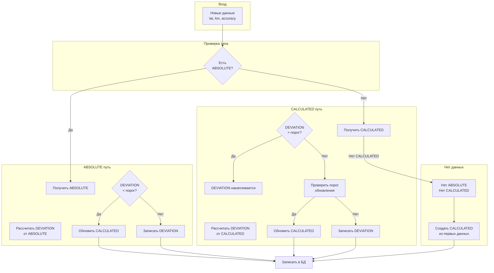

# Coordinate Validator - Модель данных

## Три типа координат

### 1. ABSOLUTE (Абсолютные)
**Источник:** Надёжный API (высокоточные данные)

| Поле | Описание |
|------|----------|
| point_id | BSSID / Cell ID / MAC |
| point_type | wifi / cell / bt |
| latitude | Абсолютная широта |
| longitude | Абсолютная долгота |
| accuracy | Точность источника |
| source | Источник (gps_raw, glonass, etc) |
| timestamp | Время получения |
| expires_at | Срок действия |

### 2. CALCULATED (Вычисленные)
**Источник:** Расчёт при обучении

| Поле | Описание |
|------|----------|
| point_id | BSSID / Cell ID / MAC |
| point_type | wifi / cell / bt |
| latitude | Вычисленная широта |
| longitude | Вычисленная долгота |
| confidence | Уверенность (0-1) |
| observations | Кол-во наблюдений |
| calculated_at | Время расчёта |
| valid_until | Действительно до |

### 3. DEVIATION (Отклонения)
**Источник:** Текущие измерения

| Поле | Описание |
|------|----------|
| point_id | BSSID / Cell ID / MAC |
| point_type | wifi / cell / bt |
| latitude | Текущая широта |
| longitude | Текущая долгота |
| deviation | Отклонение в метрах |
| measured_at | Время измерения |

---

## Flow обучения



---

## Алгоритм

### При получении новых координат:

```
1. Есть ABSOLUTE для этой точки?
   │
   ├─ Да:
   │   2. DEVIATION = distance(new, ABSOLUTE)
   │   3. DEVIATION < порог_абсолютной?
   │      │
   │      ├─ Да: CALCULATED = ABSOLUTE (или усреднение)
   │      └─ Нет: Записать DEVIATION, не обновлять CALCULATED
   │
   └─ Нет:
       2. Есть CALCULATED?
          │
          ├─ Да:
          │   3. DEVIATION = distance(new, CALCULATED)
          │   4. DEVIATION > порог_отклонения?
          │      │
          │      ├─ Да: Записать DEVIATION в историю
          │      │      (накопление для анализа)
          │      └─ Нет: Проверить порог_обновления
          │         │
          │         ├─ Да: CALCULATED = усреднить(new, CALCULATED)
          │         └─ Нет: Записать DEVIATION
          │
          └─ Нет:
              2. Создать CALCULATED = new
```

### Пороги:

| Параметр | Значение | Описание |
|-----------|----------|----------|
| ABSOLUTE_THRESHOLD | 50 м | Макс отклонение от абсолютных |
| DEVIATION_UPDATE | 100 м | Порог для обновления вычисленных |
| MIN_OBSERVATIONS | 3 | Мин наблюдений для расчёта |
| CALCULATED_TTL | 30 дней | Срок жизни вычисленных |

---

## Redis структура

```
# ABSOLUTE координаты (приоритет)
absolute:{type}:{id} → {
    lat, lon, accuracy, source, 
    timestamp, expires_at
}

# Вычисленные координаты  
calculated:{type}:{id} → {
    lat, lon, confidence, observations,
    calculated_at, valid_until
}

# Текущие отклонения (для накопления)
deviation:{type}:{id} → {
    lat, lon, deviation_meters,
    measured_at
}

# История отклонений (для анализа)
deviation_history:{type}:{id} → [
    {lat, lon, deviation, measured_at},
    ...
]
```

---

## ClickHouse таблицы

### point_absolute
```sql
CREATE TABLE point_absolute (
    point_type Enum8('wifi'=0, 'cell'=1, 'bt'=2),
    point_id String,
    latitude Float64,
    longitude Float64,
    accuracy Float32,
    source String,
    timestamp DateTime64,
    expires_at DateTime64,
    created_at DateTime DEFAULT now()
) ENGINE = MergeTree()
ORDER BY (point_type, point_id);
```

### point_calculated
```sql
CREATE TABLE point_calculated (
    point_type Enum8('wifi'=0, 'cell'=1, 'bt'=2),
    point_id String,
    latitude Float64,
    longitude Float64,
    confidence Float32,
    observations UInt32,
    calculated_at DateTime64,
    valid_until DateTime64,
    updated_at DateTime DEFAULT now()
) ENGINE = MergeTree()
ORDER BY (point_type, point_id);
```

### point_deviation
```sql
CREATE TABLE point_deviation (
    point_type Enum8('wifi'=0, 'cell'=1, 'bt'=2),
    point_id String,
    latitude Float64,
    longitude Float64,
    deviation_meters Float32,
    measured_at DateTime64,
    created_at DateTime DEFAULT now()
) ENGINE = MergeTree()
PARTITION BY toYYYYMM(created_at)
ORDER BY (point_type, point_id, measured_at);
```

---

## API для ABSOLUTE координат

```protobuf
// Добавление абсолютных координат
service CoordinateValidator {
    // Валидация (существующий)
    rpc Validate(CoordinateRequest) returns (CoordinateResponse);
    
    // Добавить абсолютные координаты (от надёжного источника)
    rpc SetAbsoluteCoordinates(AbsoluteCoordinatesRequest) returns (AbsoluteCoordinatesResponse);
    
    // Получить известные координаты точки
    rpc GetPointCoordinates(PointRequest) returns (PointResponse);
}

message AbsoluteCoordinatesRequest {
    string point_id = 1;
    PointType point_type = 2;
    double latitude = 3;
    double longitude = 4;
    float accuracy = 5;
    string source = 6;  // "gps_raw", "glonass", "manual"
    int64 expires_at = 7;  // Unix timestamp
}

message PointRequest {
    string point_id = 1;
    PointType point_type = 2;
}

message PointResponse {
    AbsoluteCoordinates absolute = 1;
    CalculatedCoordinates calculated = 2;
    repeated DeviationRecord deviations = 3;
}
```

---

## Пример сценария

```
1. Устройство передаёт WiFi BSSID="AA:BB:CC:DD:EE:FF"
   с координатами lat=55.7558, lon=37.6173

2. В Redis нет данных → создаём CALCULATED:
   - lat=55.7558, lon=37.6173, confidence=0.5, observations=1

3. Через время приходит ABSOLUTE (от GPS):
   - lat=55.7559, lon=37.6175, accuracy=5m

4. DEVIATION = 24 метра < 50м (ABSOLUTE_THRESHOLD)
   → Обновляем CALCULATED = ABSOLUTE
   - lat=55.7559, lon=37.6175, confidence=0.9, observations=2

5. Новое измерение: lat=55.7565, lon=37.6180
   - DEVIATION от CALCULATED = 54м
   - 54м < 100м (DEVIATION_UPDATE) → не обновляем
   - Записываем DEVIATION в историю

6. Накопилось 5 измерений с отклонениями 40-60м
   - Среднее отклонение > порога
   → Обновляем CALCULATED
```
