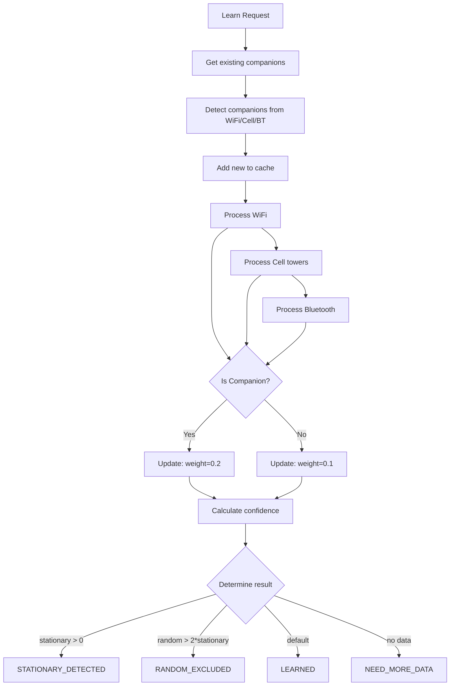

# Learning Model

## Two Data Streams

### 1. Refinement (Validation)
- **Поток:** Входящие данные для валидации
- **Операции:** Только чтение из кэша
- **Обучение:** НЕ участвует
- **API:** `Validate`, `ValidateBatch` → Refinement API (порт 50051)

### 2. Learning
- **Поток:** Данные для обучения
- **Операции:** Чтение + запись в кэш
- **Обучение:** Companion detection, обновление координат
- **API:** `LearnFromCoordinates` → Learning API (порт 50052)

---

## Algorithm: Companion Detection



---

## Confidence Calculation

```go
func calculateConfidence(obsCount int64) float64 {
    // Confidence grows logarithmically with observations
    // Max ~0.95 at 1000 observations
    const maxObs = 1000.0
    const maxConf = 0.95
    
    if obsCount <= 1 {
        return 0.3
    }
    
    return maxConf * (1 - math.Exp(-float64(obsCount)/maxObs*5))
}
```

### Confidence Thresholds

| Level | Threshold | Result |
|-------|-----------|--------|
| High | ≥ 0.8 | VALID |
| Medium | 0.3 - 0.79 | UNCERTAIN |
| Low | < 0.3 | INVALID |

---

## Configuration Parameters

### Validation Parameters

| Parameter | Default | Range | Description |
|-----------|---------|-------|-------------|
| `validation.max_speed_kmh` | 150 | 50-500 | Max speed (km/h) |
| `validation.max_time_diff_hours` | 12 | 1-72 | Max timestamp deviation |
| `validation.confidence.high` | 0.8 | 0.5-1.0 | High confidence threshold |
| `validation.confidence.medium` | 0.5 | 0.3-0.8 | Medium confidence threshold |
| `validation.confidence.low` | 0.3 | 0.1-0.5 | Low confidence threshold |

### Learning Parameters

| Parameter | Default | Range | Description |
|-----------|---------|-------|-------------|
| `learning.min_observations` | 3 | 1-10 | Min observations for stationary |
| `learning.variance_threshold` | 0.0001 | 0.00001-0.001 | Max lat/lon variance |
| `learning.weight.companion` | 0.2 | 0.1-0.5 | Weight for companion updates |
| `learning.weight.random` | 0.1 | 0.05-0.3 | Weight for random updates |

### Positioning Parameters

| Parameter | Default | Description |
|-----------|---------|-------------|
| `positioning.radius_wifi_meters` | 50 | WiFi uncertainty radius |
| `positioning.radius_ble_meters` | 5 | BLE uncertainty radius |
| `positioning.radius_cell_meters` | 3000 | Cell tower uncertainty |
| `positioning.min_sources` | 2 | Min sources for triangulation |

---

## Redis Structure

### WiFi Cache
```json
{
  "wifi:AA:BB:CC:DD:EE:FF": {
    "bssid": "AA:BB:CC:DD:EE:FF",
    "lat": 55.7558,
    "lon": 37.6173,
    "last_seen": "2026-02-20T12:00:00Z",
    "version": 42,
    "obs_count": 150,
    "confidence": 0.87
  }
}
```

### Cell Cache
```json
{
  "cell:12345:678": {
    "cell_id": 12345,
    "lac": 678,
    "lat": 55.7558,
    "lon": 37.6173,
    "version": 10,
    "obs_count": 50,
    "confidence": 0.65
  }
}
```

### Device Position
```json
{
  "device:vehicle123": {
    "device_id": "vehicle123",
    "lat": 55.7558,
    "lon": 37.6173,
    "timestamp": 1700000000,
    "last_seen": "2026-02-20T12:00:00Z"
  }
}
```

### Companions Set
```
companions:device123 → {"wifi:AA:BB:CC:DD:EE:FF", "cell:12345:678"}
```

---

## Flow: Online vs Offline Learning

### Online Learning (real-time)
```
Request → Learning API → Learning Core → Redis write
                                           ↓
                                    Storage Service
                                           ↓
                               ClickHouse + Kafka events
```
- Latency: ~100ms
- Weight: 0.2 (companion) / 0.1 (random)

### Offline Learning (batch)
```
Cron job → Retrain model → Update thresholds → ClickHouse analytics
```
- Run: 1x/сутки (ночью)
- Model: Isolation Forest / LSTM для аномалий

---

## Kafka Events

### Refinement Event
```json
{
  "device_id": "vehicle123",
  "latitude": 55.7558,
  "longitude": 37.6173,
  "timestamp": 1700000000,
  "result": "VALID",
  "confidence": 0.92,
  "has_wifi": true,
  "has_bt": false,
  "has_cell": true,
  "event_time": "2026-02-20T12:00:00Z"
}
```

### Learning Event
```json
{
  "object_id": "device123",
  "latitude": 55.7558,
  "longitude": 37.6173,
  "timestamp": 1700000000,
  "wifi": [...],
  "cell_towers": [...],
  "is_companion": true,
  "event_time": "2026-02-20T12:00:00Z"
}
```

---

## Summary

| Category | API | Parameters |
|----------|-----|------------|
| Validation | Refinement API :50051 | max_speed, max_time, thresholds |
| Learning | Learning API :50052 | min_obs, variance, weights |
| Storage | Storage Service :50053 | batch_size, flush_interval |

All parameters are configurable via environment variables or config file.
