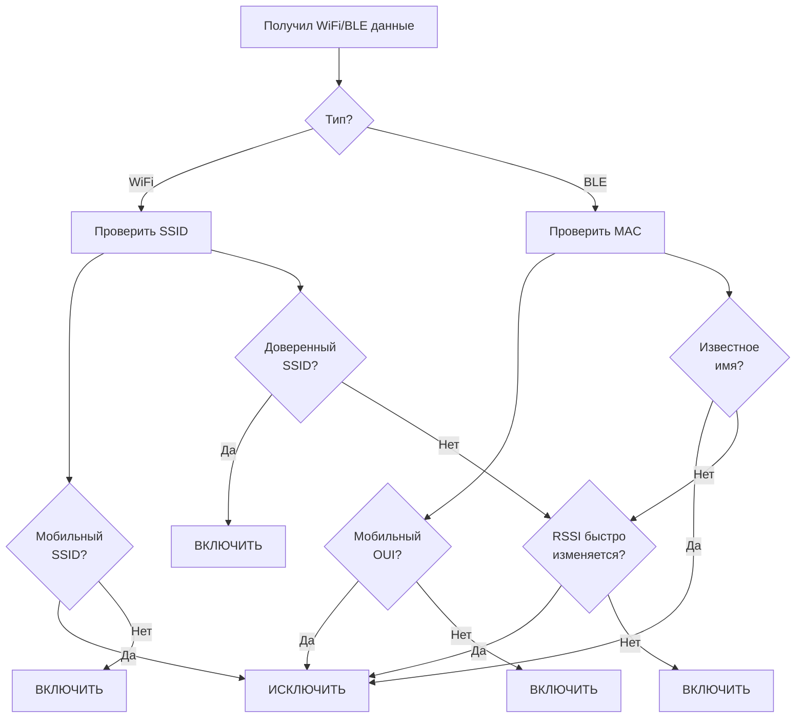

# Coordinate Validator - Модель данных

## Три типа координат

### 1. ABSOLUTE (Абсолютные)
**Источник:** Надёжный API (высокоточные данные)

| Поле | Описание |
|------|----------|
| point_id | BSSID / Cell ID / MAC |
| point_type | wifi / cell |
| latitude | Абсолютная широта |
| longitude | Абсолютная долгота |
| accuracy | Точность источника |
| source | Источник (gps_raw, glonass, etc) |
| timestamp | Время получения |
| expires_at | Срок действия |

### 2. CALCULATED (Вычисленные)
**Источник:** Расчёт при обучении

| Поле | Описание |
|------|----------|
| point_id | BSSID / Cell ID / MAC |
| point_type | wifi / cell |
| latitude | Вычисленная широта |
| longitude | Вычисленная долгота |
| confidence | Уверенность (0-1) |
| observations | Кол-во наблюдений |
| calculated_at | Время расчёта |
| valid_until | Действительно до |

### 3. DEVIATION (Отклонения)
**Источник:** Текущие измерения

| Поле | Описание |
|------|----------|
| point_id | BSSID / Cell ID / MAC |
| point_type | wifi / cell |
| latitude | Текущая широта |
| longitude | Текущая долгота |
| deviation | Отклонение в метрах |
| measured_at | Время измерения |

---

## Адаптивные пороги

Пороги зависят от количества видимых источников (сигналов):

### Формула расчёта порогов

```
BASE_THRESHOLD = 50  # метров
SOURCES_WEIGHT = 10  # метров на источник

THRESHOLD = BASE_THRESHOLD + (SOURCES_WEIGHT * (TOTAL_SOURCES - 1))
```

### Таблица порогов

| Кол-во источников | ABSOLUTE_THRESHOLD | DEVIATION_UPDATE |
|------------------|-------------------|------------------|
| 1 | 50 м | 100 м |
| 2 | 60 м | 120 м |
| 3 | 70 м | 140 м |
| 4 | 80 м | 160 м |
| 5+ | 90 м | 180 м |

**Чем больше источников → тем выше порог** (больше уверенность в результате)

---

## Фильтр мобильных устройств

### Проблема
WiFi/BLE источники могут быть **мобильными** (перемещаются вместе с объектом):
- Смартфоны
- Bluetooth наушники
- Умные часы
- Ноутбуки
- Персональные хотспоты

### Решение: Фильтрация

#### Признаки мобильного устройства:

| Признак | WiFi | BLE |
|---------|------|-----|
| SSID содержит | "iPhone", "Android", "Galaxy", "Xiaomi", "Huawei" | - |
| MAC префикс | - | Известные OUI мобильных |
| Имя (для BLE) | - | "AirPods", "Galaxy Buds", "Watch", "iWatch" |
| RSSI паттерн | Быстрое изменение | Быстрое изменение |

#### Фильтр OUI (Bluetooth MAC)

```go
// Известные производители мобильных устройств
var mobileOUI = []string{
    "00:1A:2B", // Generic
    "00:1B:44", // Samsung
    "00:1E:7D", // Apple
    "00:26:08", // Apple
    "00:25:00", // Apple
    "00:25:4B", // Apple
    "00:26:B0", // Apple
    "00:26:BB", // Apple
    "3C:5A:B4", // Google
    "00:11:22", // Generic Android
    "F0:18:98", // Apple
    "A4:5E:CB", // Apple
    "7C:D1:C3", // Apple
    "44:07:0B", // Google
    "48:A9:1C", // Samsung
    "50:01:BB", // Samsung
    "9C:20:7B", // Samsung
}
```

#### Фильтр SSID (WiFi)

```go
// Паттерны мобильных SSID
var mobileSSIDPatterns = []string{
    "iPhone",
    "Android",
    "Galaxy",
    "Xiaomi",
    "Huawei",
    "Redmi",
    "POCO",
    "OPPO",
    "Vivo",
    "OnePlus",
    "Realme",
    "iPad",
    "MacBook",
    "HUAWEI",
    "MI",
    "Redmi",
    "SM-",      // Samsung mobile
    "iPhone",   // Apple
    "iPad",     // Apple
}

var trustedSSIDPatterns = []string{
    "Home", "Work", "Office",
    "WiFi", "Guest",
    "Coffee", "Cafe", "Restaurant",
    "Store", "Shop",
}
```

### Алгоритм фильтрации



### Конфигурация фильтра

```yaml
filter:
  # BLE MAC OUI для исключения (мобильные устройства)
  ble_exclude_oui:
    - "00:1A:2B"  # Generic mobile
    - "00:1E:7D"  # Apple
    - "3C:5A:B4"  # Google
    
  # WiFi SSID паттерны для исключения
  wifi_exclude_patterns:
    - "iPhone*"
    - "Android*"
    - "Galaxy*"
    - "*iPad*"
    - "*MacBook*"
    
  # WiFi SSID паттерны для включения (доверенные)
  wifi_trusted_patterns:
    - "Home*"
    - "Work*"
    - "Office*"
    - "*Coffee*"
    
  # Минимальный RSSI для inclusion
  min_rssi: -85  # dBm
  
  # Анализ RSSI: исключить если изменение > X за Y секунд
  rssi_change_threshold: 10  # dBm
  rssi_change_window: 60     # секунд
```

---

## Flow обучения

```mermaid
flowchart TD
    subgraph Input["Вход"]
        NewData[Новые данные<br/>lat, lon, accuracy]
        Sources[Кол-во источников<br/>N]
    end

    subgraph CalcThresholds["Расчёт порогов"]
        Sources --> Thresh[THRESHOLD = 50 + (N-1)*10]
    end

    subgraph Filter["Фильтрация"]
        NewData --> MobileCheck{Мобильное<br/>устройство?}
        MobileCheck -->|Да| Skip[Пропустить]
        MobileCheck -->|Нет| Process[Обработать]
    end

    subgraph Check["Проверка типа"]
        Process --> HasAbsolute{Есть<br/>ABSOLUTE?}
    end

    subgraph Absolute["ABSOLUTE путь"]
        A1[Получить ABSOLUTE]
        A2[Рассчитать DEVIATION<br/>от ABSOLUTE]
        A3{DEVIATION<br/>< THRESHOLD?}
        A3 -->|Да| A4[Обновить CALCULATED]
        A3 -->|Нет| A5[Записать DEVIATION]
    end

    subgraph Calc["CALCULATED путь"]
        C1[Получить CALCULATED]
        C2[Рассчитать DEVIATION<br/>от CALCULATED]
        C3{DEVIATION<br/>> DEVIATION_UPDATE?}
        C3 -->|Да| C4[Записать DEVIATION]
        C3 -->|Нет| C5{Наблюдений<br/>> 3?}
        C5 -->|Да| C6[Обновить CALCULATED]
        C5 -->|Нет| C7[Записать DEVIATION]
    end

    subgraph NoData["Нет данных"]
        N1[Нет ABSOLUTE<br/>Нет CALCULATED]
        N2[Создать CALCULATED<br/>из первых данных]
    end

    HasAbsolute -->|Да| A1
    HasAbsolute -->|Нет| C1
    C1 -->|Нет CALCULATED| N1
    N1 --> N2
    
    A4 --> End[Записать в БД]
    A5 --> End
    C6 --> End
    C7 --> End
    N2 --> End
    Skip --> End
```

---

## Redis структура

```
# ABSOLUTE координаты (приоритет)
absolute:{type}:{id} → {
    lat, lon, accuracy, source, 
    timestamp, expires_at
}

# Вычисленные координаты  
calculated:{type}:{id} → {
    lat, lon, confidence, observations,
    calculated_at, valid_until
}

# Текущие отклонения (для накопления)
deviation:{type}:{id} → {
    lat, lon, deviation_meters,
    measured_at
}

# История отклонений
deviation_history:{type}:{id} → [
    {lat, lon, deviation, measured_at},
    ...
]

# Фильтр: исключённые точки
excluded:{type}:{id} → {
    reason: "mobile_ble" | "mobile_wifi" | "rssi_unstable",
    detected_at
}
```

---

## API

### Существующие методы

```protobuf
service CoordinateValidator {
    // Валидация координат
    rpc Validate(CoordinateRequest) returns (CoordinateResponse);
    
    // Batch валидация
    rpc ValidateBatch(stream CoordinateRequest) returns (stream CoordinateResponse);
}
```

### Новые методы (отдельный сервис для ABSOLUTE)

```protobuf
service AbsoluteCoordinates {
    // Добавить абсолютные координаты (от надёжного источника)
    rpc SetAbsoluteCoordinates(AbsoluteRequest) returns (AbsoluteResponse);
    
    // Удалить абсолютные координаты
    rpc RemoveAbsoluteCoordinates(RemoveRequest) returns (RemoveResponse);
    
    // Получить информацию о точке
    rpc GetPointInfo(PointRequest) returns (PointInfoResponse);
    
    // Получить список исключённых точек
    rpc GetExcludedPoints(ExcludedRequest) returns (ExcludedResponse);
}

message AbsoluteRequest {
    string point_id = 1;
    PointType point_type = 2;
    double latitude = 3;
    double longitude = 4;
    float accuracy = 5;
    string source = 6;      // "gps_raw", "glonass", "manual", "rtk"
    int64 expires_at = 7;    // Unix timestamp
}

message PointRequest {
    string point_id = 1;
    PointType point_type = 2;
}

message PointInfoResponse {
    AbsoluteCoordinates absolute = 1;
    CalculatedCoordinates calculated = 2;
    repeated DeviationRecord deviations = 3;
    bool is_excluded = 4;
    string exclusion_reason = 5;
}

message ExcludedRequest {
    PointType point_type = 1;
    int32 limit = 2;
}
```

---

## Примеры

### Пример 1: Фильтрация iPhone

```
Вход:
  WiFi BSSID: "AA:BB:CC:DD:EE:FF"
  SSID: "iPhone"
  lat: 55.7558, lon: 37.6173

Фильтр:
  SSID "iPhone" содержит паттерн "iPhone" → мобильный
  
Результат:
  Точка ИСКЛЮЧЕНА (reason: "mobile_wifi")
  Не записывается в Redis/ClickHouse
```

### Пример 2: Адаптивные пороги

```
Сценарий A: 1 источник (Cell tower)
  - ABSOLUTE_THRESHOLD = 50 + (1-1)*10 = 50м
  - DEVIATION_UPDATE = 100м

Сценарий B: 5 источников (1 Cell + 4 WiFi)
  - ABSOLUTE_THRESHOLD = 50 + (5-1)*10 = 90м
  - DEVIATION_UPDATE = 180м
  
Вывод: больше источников → выше порог → больше допустимое отклонение
```

### Пример 3: Обновление CALCULATED

```
1. ABSOLUTE: lat=55.7558, lon=37.6173, accuracy=5m
2. 3 наблюдения: 55.7560, 55.7559, 55.7557 (отклонения 22м, 11м, 12м)
3. Среднее отклонение < 50м
4. CALCULATED = lat=55.7559, lon=37.6174, confidence=0.85
```
