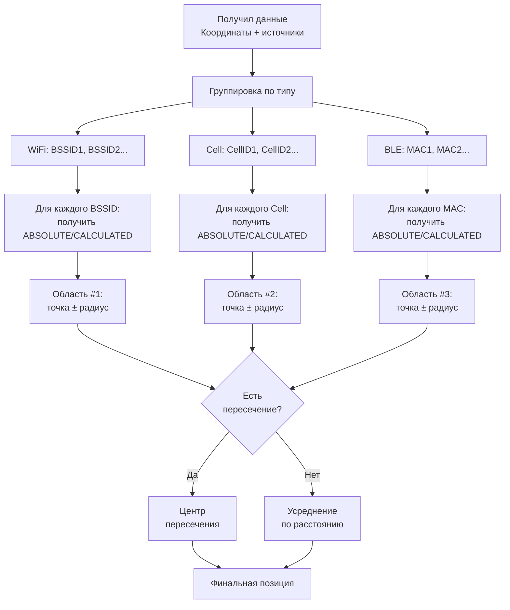
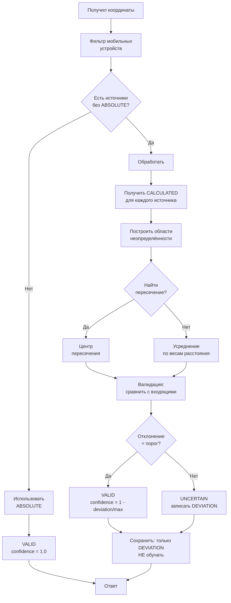

# Coordinate Validator - Модель данных

## Новая концепция: Триангуляция

### Старая модель (веса)
```
Итог = WiFi*0.4 + Cell*0.3 + BLE*0.3
```
❌ Не учитывает взаимосвязи между источниками

### Новая модель (пересечение)
```
WiFi (BSSID) ──────┐
                    │      ┌── Пересечение #1
Cell Tower ─────────┼──────┤
                    │      └── Пересечение #2
BLE Device ─────────┘

Финальная позиция = центр пересечения всех областей
```

---

## Алгоритм определения позиции

### 1. Для каждого источника — радиус неопределённости

| Источник | Точность | Радиус |
|----------|---------|--------|
| GPS | 5-50м | 50м |
| Cell (MCC+MNC+LAC) | 300м - 3км | 3000м |
| Cell (с ATC) | 50-300м | 300м |
| WiFi (BSSID) | 20-50м | 50м |
| BLE (MAC) | 5-15м | 15м |

### 2. Модель пересечения



### 3. Формула центра пересечения

```
Для 2 кругов:
  d = расстояние между центрами
  r1, r2 = радиусы
  
  Если d > r1 + r2: нет пересечения
  Если d < |r1 - r2|: один внутри другого
  
  Иначе:
    a = (r1² - r2² + d²) / (2d)
    h = √(r1² - a²)
    
    Центр пересечения:
      x = x1 + a*(x2-x1)/d ± h*(y2-y1)/d
      y = y1 + a*(y2-y1)/d ∓ h*(x2-x1)/d
```

---

## Обновлённая модель данных

### 1. ABSOLUTE — НЕ участвуют в обучении

```
ABSOLUTE — только для справочных данных
При наличии ABSOLUTE:
  - Используется для валидации
  - НЕ записывается в CALCULATED
  - НЕ участвует в обучении
```

### 2. CALCULATED — вычисленные из обучения

```
Только из наблюдений БЕЗ ABSOLUTE
```

### 3. DEVIATION — отклонения

```
Записываются:
- Только от источников БЕЗ ABSOLUTE
- Для анализа качества CALCULATED
- Для обновления CALCULATED
```

---

## Flow валидации (обновлённый)



---

## Обновлённый алгоритм обучения

### Принцип: Только "сырые" данные

```
Входные данные:
  - lat, lon, accuracy (от устройства)
  - sources: WiFi[], Cell[], BLE[]

Для каждого source (WiFi/BLE/Cell):
  1. Есть ABSOLUTE для этого source?
     │
     ├─ ДА: Пропустить (не обучаем)
     └─ НЕТ:
        ├─ Есть CALCULATED?
        │   ├─ ДА: Записать DEVIATION, проверить обновление
        │   └─ НЕТ: Создать CALCULATED
```

### Обновление CALCULATED

```
DEVIATION_HISTORY = [d1, d2, d3, ... dn]  (последние N)

avg_deviation = mean(DEVIATION_HISTORY)
max_deviation = max(DEVIATION_HISTORY)

ЕСЛИ avg_deviation < THRESHOLD:
    CALCULATED = обновить (усреднение)
ИНАЧЕ:
    CALCULATED = оставить как есть
    (источник ненадёжен)
```

---

## Конфигурация

```yaml
positioning:
  # Радиусы неопределённости по источникам
  radius:
    wifi: 50        # метров
    ble: 15         # метров  
    cell_lac: 3000  # метров (только LAC)
    cell_atc: 300   # метров (с ATC)
  
  # Минимум источников для пересечения
  min_sources: 2
  
  # Пороги для обновления CALCULATED
  learning:
    deviation_threshold: 50    # метров
    min_observations: 3
    max_history: 10

# Фильтр мобильных устройств
filter:
  ble_exclude_oui:
    - "00:1E:7D"  # Apple
    - "3C:5A:B4"  # Google
    # ...
  wifi_exclude_patterns:
    - "iPhone*"
    - "Android*"
    - "Galaxy*"
```

---

## Примеры

### Пример 1: Пересечение WiFi + Cell

```
Входные данные:
  GPS: lat=55.7558, lon=37.6173
  WiFi BSSID1: AA:BB:CC:DD:EE:FF → CALCULATED: 55.7555, 37.6170 (радиус 50м)
  Cell CID=12345, LAC=678 → CALCULATED: 55.7560, 37.6180 (радиус 300м)

Области:
  - WiFi: круг (55.7555, 37.6170, r=50м)
  - Cell: круг (55.7560, 37.6180, r=300м)

Пересечение: ЕСТЬ

Центр пересечения: 55.7557, 37.6172

Сравнение с GPS:
  distance = 14м
  deviation = 14м < 50м → VALID
```

### Пример 2: Нет пересечения

```
Входные данные:
  GPS: lat=55.7558, lon=37.6173
  WiFi BSSID1: → CALCULATED: 55.7520, 37.6100 (радиус 50м) — далеко!
  Cell: → CALCULATED: 55.7600, 37.6200 (радиус 300м)

Области НЕ пересекаются (d > r1 + r2)

Решение: Усреднение по расстоянию до центра
  - Вес WiFi: 1/50 = 0.02
  - Вес Cell: 1/300 = 0.003
  
  Итог = (WiFi * 0.02 + Cell * 0.003) / (0.02 + 0.003)
```

### Пример 3: ABSOLUTE — не обучаем

```
Входные данные:
  GPS: lat=55.7558, lon=37.6173
  WiFi BSSID1: → ABSOLUTE: 55.7555, 37.6170 (от надёжного API)

Для этого WiFi:
  - ABSOLUTE ЕСТЬ → ПРОПУСК
  - НЕ создаём CALCULATED
  - НЕ записываем DEVIATION
  
Используем ABSOLUTE для валидации
```

---

## API (без изменений)

```protobuf
service CoordinateValidator {
    rpc Validate(CoordinateRequest) returns (CoordinateResponse);
    rpc ValidateBatch(stream CoordinateRequest) returns (stream CoordinateResponse);
}

service AbsoluteCoordinates {
    rpc SetAbsoluteCoordinates(AbsoluteRequest) returns (AbsoluteResponse);
    rpc RemoveAbsoluteCoordinates(RemoveRequest) returns (RemoveResponse);
    rpc GetPointInfo(PointRequest) returns (PointInfoResponse);
}
```

---

## Резюме изменений

| Старое | Новое |
|--------|-------|
| Веса: WiFi 0.4, Cell 0.3, BLE 0.3 | Пересечение областей |
| Все источники участвуют в обучении | ABSOLUTE — НЕ участвуют |
| CALCULATED обновляется всегда | CALCULATED обновляется только при avg_deviation < порог |

---

## Следующие шаги

1. ✅ Фильтр мобильных устройств
2. ✅ Адаптивные пороги
3. ✅ Триангуляция / пересечение
4. ✅ ABSOLUTE — не обучаем
5. ⏳ Реализация кода

Всё устраивает? Начинаем кодить? 🚕
